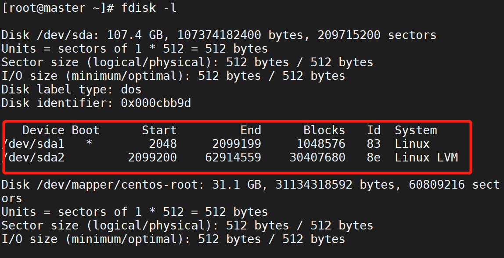
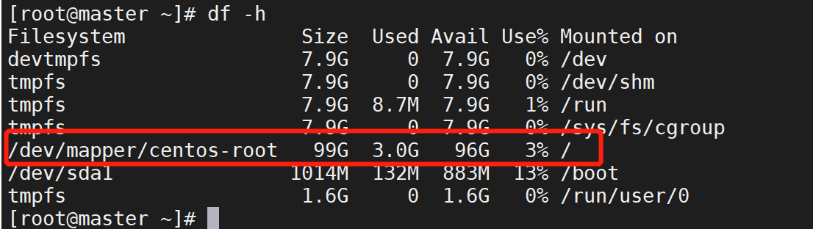

## 磁盘扩容

> 编辑虚拟机调整硬盘空间，重启虚拟机

> 查看分区后扩容后的大小

    fdisk -l
    

已经扩到了100G（扩容前30G）

> 新建分区并设置分区为LVM格式

    fdisk /dev/sda
    

最后键入w写入

> 创建物理卷，并加入到卷组

    partprobe
    pvcreate /dev/sda3
    

    
扩展vg卷组大小

    vgs
    vgextend /dev/centos /dev/sda3
    vgs

> 使用lvextend命令来扩容lv逻辑卷空间大小

    lvs
    lvextend -L +69.9G /dev/centos/root
    

查看文件系统

    df -lhT

    
重新加载逻辑卷的大小

- xfs

    xfs_growfs /dev/centos/root
    
- ext2、ext3、ext4

    resize2fs /dev/centos/root
    
> 查看磁盘大小

    df -h    
    

    

### 逻辑卷组删除物理设备

https://www.linuxprobe.com/delete-physical-volume.html

    