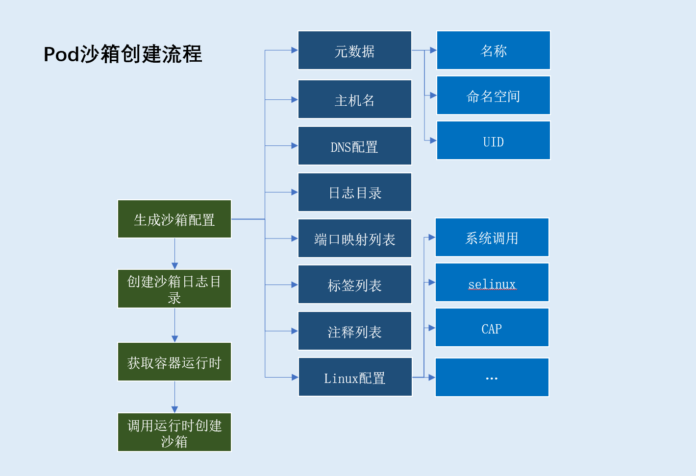

# 创建pod沙箱

这里的`pod`沙箱其实就是`pod pause`容器

## pod沙箱创建流程



> 流程解析

pod沙箱创建流程，主要分为以下步骤:

1. 生成沙箱容器配置，配置包含：
- 沙箱元数据（基于元数据生成沙箱唯一标识）
    - `pod`沙箱名称（取值pod名称）
    - `pod`沙箱命名空间（取值pod命名空间）
    - `uid`（取值`pod uid`）
- `pod`沙箱主机名（一般取值pod名称）
- `pod`沙箱日志目录
- `pod`沙箱`DNS`配置（`DNS server、search domain`）
- `pod`沙箱端口映射列表（遍历pod下容器端口映射获得）
- `pod`沙箱标签集合
    - `pod`定义标签: `metadata.labels`字段
    - `kubelet`注入标签: `io.kubernetes.pod.name`、`io.kubernetes.pod.namespace`、`io.kubernetes.pod.uid`
- `pod`沙箱注释集合: `metadata.annonations`字段
- `linux`相关配置: 系统调用、`SELinuxOptions`等

2. 创建`pod`沙箱日志目录(`/var/log/pods/<pod namespace>_<pod name>_<pod uid>`)
3. 获取容器运行时
4. 根据`pod`容器运行时、`pod`沙箱配置创建`pod`沙箱

> 源码解析

`kubernetes\pkg\kubelet\kuberuntime\kuberuntime_sandbox.go`
```go
func (m *kubeGenericRuntimeManager) createPodSandbox(pod *v1.Pod, attempt uint32) (string, string, error) {
	podSandboxConfig, err := m.generatePodSandboxConfig(pod, attempt)
	if err != nil {
		message := fmt.Sprintf("GeneratePodSandboxConfig for pod %q failed: %v", format.Pod(pod), err)
		klog.Error(message)
		return "", message, err
	}

	// Create pod logs directory
	err = m.osInterface.MkdirAll(podSandboxConfig.LogDirectory, 0755)
	if err != nil {
		message := fmt.Sprintf("Create pod log directory for pod %q failed: %v", format.Pod(pod), err)
		klog.Errorf(message)
		return "", message, err
	}

	runtimeHandler := ""
	if utilfeature.DefaultFeatureGate.Enabled(features.RuntimeClass) && m.runtimeClassManager != nil {
		runtimeHandler, err = m.runtimeClassManager.LookupRuntimeHandler(pod.Spec.RuntimeClassName)
		if err != nil {
			message := fmt.Sprintf("CreatePodSandbox for pod %q failed: %v", format.Pod(pod), err)
			return "", message, err
		}
		if runtimeHandler != "" {
			klog.V(2).Infof("Running pod %s with RuntimeHandler %q", format.Pod(pod), runtimeHandler)
		}
	}

	podSandBoxID, err := m.runtimeService.RunPodSandbox(podSandboxConfig, runtimeHandler)
	if err != nil {
		message := fmt.Sprintf("CreatePodSandbox for pod %q failed: %v", format.Pod(pod), err)
		klog.Error(message)
		return "", message, err
	}

	return podSandBoxID, "", nil
}
```

从上面代码中我们发现有个`RuntimeClass`特性，这个特性是干嘛的？

### RuntimeClass是什么？

> 背景介绍

`Kubernetes`最初是为了支持在`Linux`主机上运行本机应用程序的`Docker`容器而创建的。
从`Kubernetes 1.3`中的`rkt`开始，更多的运行时间开始涌现，这导致了容器运行时接口（`Container Runtime Interface`）（`CRI`）的开发。
从那时起，备用运行时集合越来越大：为了加强工作负载隔离，`Kata Containers`和`gVisor`等项目被发起，并且`Kubernetes`对`Windows`的支持正在稳步发展。

由于存在诸多针对不同用例的运行时，集群对混合运行时的需求变得明晰起来。但是，所有这些不同的容器运行方式都带来了一系列新问题要处理：

1. 用户如何知道哪些运行时可用，并为其工作负载选择运行时？
2. 我们如何确保将`Pod`被调度到支持所需运行时的节点上？
3. 哪些运行时支持哪些功能，以及我们如何向用户显示不兼容性？
4. 我们如何考虑运行时的各种资源开销？

`RuntimeClass`旨在解决这些问题。

> 什么场景需要多个运行时？

举个例子，有一个开放的云平台向外部用户提供容器服务，平台上运行有两种容器，一种是云平台管理用的容器（可信的），一种是用户部署的业务容器（不可信）。
在这种场景下，我们希望使用`runc`运行可信容器（弱隔离但性能好），用`runv`运行不可信容器（强隔离安全性好）。

> 值得注意的是：`RuntimeClass`是`Pod`级别的概念(即同一pod内容器的运行时必须相同)

为什么`RuntimeClass`是`Pod`级别的概念？

`Kubernetes`资源模型期望`Pod`中的容器之间可以共享某些资源。如果`Pod`由具有不同资源模型的不同容器组成，支持必要水平的资源共享变得非常具有挑战性。

例如，要跨`VM`边界支持本地回路（`localhost`）接口非常困难，但这是`Pod`中两个容器之间通信的通用模型。

> 如何使用`RuntimeClass`

1. 在`Kubernetes worker`节点配置`CRI shim`

例如`CRI-O`运行时的配置，需要在文件`/etc/crio/crio.conf`定义`runtime`的`handler_name`
```
[crio.runtime.runtimes.${HANDLER_NAME}]
runtime_path = "${PATH_TO_BINARY}"
```

2. 创建`RuntimeClass`资源对象；

```shell
$ cat <<EOF | kubectl apply -f -
apiVersion: node.k8s.io/v1beta1  # RuntimeClass is defined in the node.k8s.io API group
kind: RuntimeClass
metadata:
  name: myclass  # The name the RuntimeClass will be referenced by
  # RuntimeClass is a non-namespaced resource
handler: myconfiguration  # The name of the corresponding CRI configuration
EOF
```

3. 在`pod`中指定`RuntimeClass`

```yaml
apiVersion: v1
kind: Pod
metadata:
  name: mypod
spec:
  runtimeClassName: myclass
  # ...
```

### docker运行时下创建启动pod沙箱的具体流程

上文中我们已经拥有了创建`pod`沙箱所需的配置，接下来我们针对`docker`运行时下，创建启动`pod`沙箱的流程做进一步分析

`docker`运行时下，`pod`沙箱实质是由一个包含该`pod`的网络名称空间的容器实现的。

创建启动流程如下：

1. 拉取`pod`沙箱所需镜像（即`pause`容器镜像，默认`k8s.gcr.io/pause:3.2`）
2. 根据配置调用运行时创建沙箱容器（即`pause`容器）
3. 创建沙箱容器检查端点（pod下容器的端接口映射列表）
4. 启动沙箱容器，如果启动失败将被回收。启动成功后重写`docker`生成的`/etc/resolv.conf`文件
5. 设置沙箱容器网络: 如果`pod`共享主机网络命名空间，则跳过后续流程直接返回。此时创建启动`pod`沙箱流程结束。

> 源码解析

`kubernetes\pkg\kubelet\dockershim\docker_sandbox.go`

```go
func (ds *dockerService) RunPodSandbox(ctx context.Context, r *runtimeapi.RunPodSandboxRequest) (*runtimeapi.RunPodSandboxResponse, error) {
	config := r.GetConfig()

	// Step 1: Pull the image for the sandbox.
	image := defaultSandboxImage
	podSandboxImage := ds.podSandboxImage
	if len(podSandboxImage) != 0 {
		image = podSandboxImage
	}

	// NOTE: To use a custom sandbox image in a private repository, users need to configure the nodes with credentials properly.
	// see: http://kubernetes.io/docs/user-guide/images/#configuring-nodes-to-authenticate-to-a-private-repository
	// Only pull sandbox image when it's not present - v1.PullIfNotPresent.
	if err := ensureSandboxImageExists(ds.client, image); err != nil {
		return nil, err
	}

	// Step 2: Create the sandbox container.
	if r.GetRuntimeHandler() != "" && r.GetRuntimeHandler() != runtimeName {
		return nil, fmt.Errorf("RuntimeHandler %q not supported", r.GetRuntimeHandler())
	}
	createConfig, err := ds.makeSandboxDockerConfig(config, image)
	if err != nil {
		return nil, fmt.Errorf("failed to make sandbox docker config for pod %q: %v", config.Metadata.Name, err)
	}
	createResp, err := ds.client.CreateContainer(*createConfig)
	if err != nil {
		createResp, err = recoverFromCreationConflictIfNeeded(ds.client, *createConfig, err)
	}

	if err != nil || createResp == nil {
		return nil, fmt.Errorf("failed to create a sandbox for pod %q: %v", config.Metadata.Name, err)
	}
	resp := &runtimeapi.RunPodSandboxResponse{PodSandboxId: createResp.ID}

	ds.setNetworkReady(createResp.ID, false)
	defer func(e *error) {
		// Set networking ready depending on the error return of
		// the parent function
		if *e == nil {
			ds.setNetworkReady(createResp.ID, true)
		}
	}(&err)

	// Step 3: Create Sandbox Checkpoint.
	if err = ds.checkpointManager.CreateCheckpoint(createResp.ID, constructPodSandboxCheckpoint(config)); err != nil {
		return nil, err
	}

	// Step 4: Start the sandbox container.
	// Assume kubelet's garbage collector would remove the sandbox later, if
	// startContainer failed.
	err = ds.client.StartContainer(createResp.ID)
	if err != nil {
		return nil, fmt.Errorf("failed to start sandbox container for pod %q: %v", config.Metadata.Name, err)
	}

	// Rewrite resolv.conf file generated by docker.
	// NOTE: cluster dns settings aren't passed anymore to docker api in all cases,
	// not only for pods with host network: the resolver conf will be overwritten
	// after sandbox creation to override docker's behaviour. This resolv.conf
	// file is shared by all containers of the same pod, and needs to be modified
	// only once per pod.
	if dnsConfig := config.GetDnsConfig(); dnsConfig != nil {
		containerInfo, err := ds.client.InspectContainer(createResp.ID)
		if err != nil {
			return nil, fmt.Errorf("failed to inspect sandbox container for pod %q: %v", config.Metadata.Name, err)
		}

		if err := rewriteResolvFile(containerInfo.ResolvConfPath, dnsConfig.Servers, dnsConfig.Searches, dnsConfig.Options); err != nil {
			return nil, fmt.Errorf("rewrite resolv.conf failed for pod %q: %v", config.Metadata.Name, err)
		}
	}

	// Do not invoke network plugins if in hostNetwork mode.
	if config.GetLinux().GetSecurityContext().GetNamespaceOptions().GetNetwork() == runtimeapi.NamespaceMode_NODE {
		return resp, nil
	}

	// Step 5: Setup networking for the sandbox.
	// All pod networking is setup by a CNI plugin discovered at startup time.
	// This plugin assigns the pod ip, sets up routes inside the sandbox,
	// creates interfaces etc. In theory, its jurisdiction ends with pod
	// sandbox networking, but it might insert iptables rules or open ports
	// on the host as well, to satisfy parts of the pod spec that aren't
	// recognized by the CNI standard yet.
	cID := kubecontainer.BuildContainerID(runtimeName, createResp.ID)
	networkOptions := make(map[string]string)
	if dnsConfig := config.GetDnsConfig(); dnsConfig != nil {
		// Build DNS options.
		dnsOption, err := json.Marshal(dnsConfig)
		if err != nil {
			return nil, fmt.Errorf("failed to marshal dns config for pod %q: %v", config.Metadata.Name, err)
		}
		networkOptions["dns"] = string(dnsOption)
	}
	err = ds.network.SetUpPod(config.GetMetadata().Namespace, config.GetMetadata().Name, cID, config.Annotations, networkOptions)
	if err != nil {
		errList := []error{fmt.Errorf("failed to set up sandbox container %q network for pod %q: %v", createResp.ID, config.Metadata.Name, err)}

		// Ensure network resources are cleaned up even if the plugin
		// succeeded but an error happened between that success and here.
		err = ds.network.TearDownPod(config.GetMetadata().Namespace, config.GetMetadata().Name, cID)
		if err != nil {
			errList = append(errList, fmt.Errorf("failed to clean up sandbox container %q network for pod %q: %v", createResp.ID, config.Metadata.Name, err))
		}

		err = ds.client.StopContainer(createResp.ID, defaultSandboxGracePeriod)
		if err != nil {
			errList = append(errList, fmt.Errorf("failed to stop sandbox container %q for pod %q: %v", createResp.ID, config.Metadata.Name, err))
		}

		return resp, utilerrors.NewAggregate(errList)
	}

	return resp, nil
}
```

> 设置沙箱容器网络流程解析: 调用`CNI`进行`pod`网络配置

`kubernetes`下容器网络由`CNI`管理，而非容器运行时。

`CNI`负责分配`pod ip`，在沙箱中设置路由，创建接口等。理论上，它的管辖范围仅限于`pod`沙箱网络，但它也可能在主机上插入`iptables`规则或开放端口，以满足`CNI`标准还不认可的`pod`规范的部分。

## 参考文献

[Kubernetes v1.12: RuntimeClass 简介](https://kubernetes.io/zh/blog/2018/10/10/kubernetes-v1.12-runtimeclass-%E7%AE%80%E4%BB%8B/)