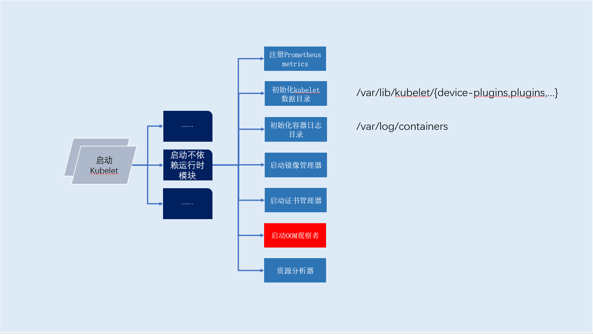

# 启动oomWatcher

## 概述

`oomWatcher`是一个`kubelet`子模块，在`kubelet`启动流程内启动。
通过与`cAdvisor`模块交互采集主机`oom`进程信息，启动阶段如下图（红色部分）



> oomWatcher是做什么的？

`oomWatcher`记录系统`oom`并记录到节点的`event`

## 解析

> 流程解析

`oomWatcher`模块在启动的时候会`fork`出两个`goroutine`，一个作为`oom`事件生产者，一个作为`oom`事件消费者。
两个`goroutine`采用`channel`进行数据传输。


```go
// Start watches for system oom's and records an event for every system oom encountered.
func (ow *realWatcher) Start(ref *v1.ObjectReference) error {
	outStream := make(chan *oomparser.OomInstance, 10)

	// cAdvisor模块 从/dev/kmsg读取数据解析出oom容器信息：宿主机pid、时间戳、容器名称、容器内进程名称
	go ow.oomStreamer.StreamOoms(outStream)
	
	go func() {
		defer runtime.HandleCrash()

		for event := range outStream {
			if event.ContainerName == recordEventContainerName {
				klog.V(1).Infof("Got sys oom event: %v", event)
				eventMsg := "System OOM encountered"
				if event.ProcessName != "" && event.Pid != 0 {
					eventMsg = fmt.Sprintf("%s, victim process: %s, pid: %d", eventMsg, event.ProcessName, event.Pid)
				}
				ow.recorder.Eventf(ref, v1.EventTypeWarning, systemOOMEvent, eventMsg)
			}
		}
		klog.Errorf("Unexpectedly stopped receiving OOM notifications")
	}()
	return nil
}
```

> 数据源采集

`cAdvisor`模块从`/dev/kmsg`读取数据解析出`oom`容器信息：`pid`、`oom`时间戳、容器名称、容器内进程名称等。其中字段值如下：

- 优先级: `6`
- 序列号: `4029`
- 时间戳: `2021308979`
- 信息:  `[  pid  ]   uid  tgid total_vm      rss pgtables_bytes swapents oom_score_adj name`

```shell
$ cat /dev/kmsg
...
6,4029,2021308979,-;[  pid  ]   uid  tgid total_vm      rss pgtables_bytes swapents oom_score_adj name
...
```

> 数据处理

1. 数据过滤

过滤出`oom`信息，过滤规则：正则匹配包含`invoked oom-killer:`字符串的行。

随后利用正则匹配+字符串分割生成对应对象

```
4,3994,2021308860,-;java invoked oom-killer: gfp_mask=0xcc0(GFP_KERNEL), order=0, oom_score_adj=999
```

2. 数据解析

- 获取进程`pid`: 正则匹配+字符串分割
- 获取容器名称: 正则匹配+字符串分割

```go
// StreamOoms writes to a provided a stream of OomInstance objects representing
// OOM events that are found in the logs.
// It will block and should be called from a goroutine.
func (self *OomParser) StreamOoms(outStream chan<- *OomInstance) {
	// 通道内写入/dev/kmsg内解析的数据：、序列号、时间戳、信息。如：
	// - 优先级: 6
	// - 序列号: 4029
	// - 时间戳: 2021308979
	// - 信息:  [  pid  ]   uid  tgid total_vm      rss pgtables_bytes swapents oom_score_adj name
	// 6,4029,2021308979,-;[  pid  ]   uid  tgid total_vm      rss pgtables_bytes swapents oom_score_adj name
	kmsgEntries := self.parser.Parse()
	defer self.parser.Close()

	for msg := range kmsgEntries {
		// 正则查找oom进程实例，正则规则为：包含`invoked oom-killer:`字符串
		// 4,3994,2021308860,-;java invoked oom-killer: gfp_mask=0xcc0(GFP_KERNEL), order=0, oom_score_adj=999
		in_oom_kernel_log := checkIfStartOfOomMessages(msg.Message)
		if in_oom_kernel_log {
			oomCurrentInstance := &OomInstance{
				ContainerName:       "/",
				VictimContainerName: "/",
				TimeOfDeath:         msg.Timestamp,
			}
			for msg := range kmsgEntries {
				// 获取容器名称(docker下貌似为空)
				err := getContainerName(msg.Message, oomCurrentInstance)
				if err != nil {
					klog.Errorf("%v", err)
				}
				// 获取进程id
				// 3,13796,359453210036,-;Memory cgroup out of memory: Killed process 61746 (nginx) total-vm:10668kB, anon-rss:892kB, file-rss:12kB, shmem-rss:0kB, UID:0 pgtables:56kB oom_score_adj:999
				finished, err := getProcessNamePid(msg.Message, oomCurrentInstance)
				if err != nil {
					klog.Errorf("%v", err)
				}
				if finished {
					oomCurrentInstance.TimeOfDeath = msg.Timestamp
					break
				}
			}
			outStream <- oomCurrentInstance
		}
	}
	// Should not happen
	klog.Errorf("exiting analyzeLines. OOM events will not be reported.")
}
```

> 数据源消费

`cAdvisor`模块生产出的`oom`进程信息，最终被记录至节点的`event`，可通过以下方式获取相关信息。

```shell
$ kubectl describe node <node-name>
...
		Events:
	  Type     Reason     Age    From            Message
	  ----     ------     ----   ----            -------
	  Warning  SystemOOM  13m    kubelet, node1  System OOM encountered, victim process: nginx, pid: 60867
	  Warning  SystemOOM  13m    kubelet, node1  System OOM encountered, victim process: nginx, pid: 61438
	  Warning  SystemOOM  13m    kubelet, node1  System OOM encountered, victim process: nginx, pid: 61746
	  Warning  SystemOOM  12m    kubelet, node1  System OOM encountered, victim process: runc:[2:INIT], pid: 71899
	  Warning  SystemOOM  12m    kubelet, node1  System OOM encountered, victim process: nginx, pid: 82162
	  Warning  SystemOOM  11m    kubelet, node1  System OOM encountered, victim process: nginx, pid: 96195
	  Warning  SystemOOM  10m    kubelet, node1  System OOM encountered, victim process: runc:[2:INIT], pid: 12707
	  Warning  SystemOOM  7m33s  kubelet, node1  System OOM encountered, victim process: nginx, pid: 87657
	  Warning  SystemOOM  2m32s  kubelet, node1  System OOM encountered, victim process: runc:[2:INIT], pid: 98756
...
```