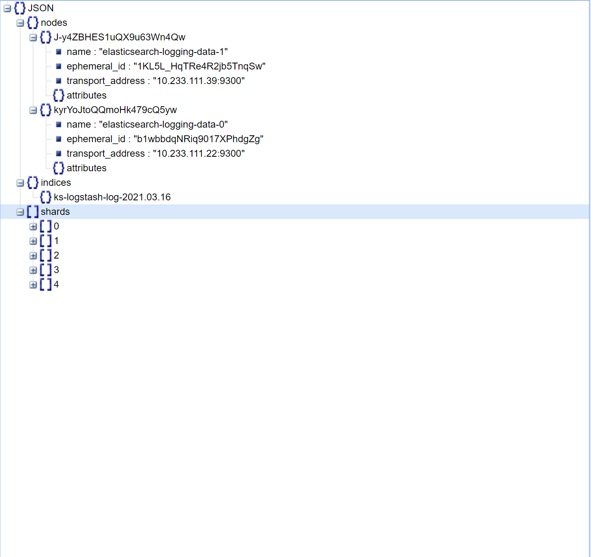

## 扩容数据节点

`ES`每个索引默认`5`个主分片, 而每个主分片都相应的有一个副本。

> 查看es索引

    [root@ceph01 ~]# kubectl -n kubesphere-logging-system exec -it elasticsearch-logging-data-0 -- curl -XGET 'localhost:9200/_cat/indices?v&pretty'
    health status index                         uuid                   pri rep docs.count docs.deleted store.size pri.store.size
    green  open   ks-logstash-log-2021.03.15    Ch7ACUwWQlinSz8WB8GvWA   5   1    2538499            0      1.8gb        962.4mb
    green  open   ks-logstash-events-2021.03.15 EkPSa0acR4umfw7hbf_kFA   5   1      16049            0     19.9mb          9.9mb
    green  open   ks-logstash-log-2021.03.16    GRrg9bRsRQKG22ef5WrDUw   5   1    1466740            0        1gb        556.7mb
    green  open   ks-logstash-events-2021.03.16 wpDRAwpPQ1e1B7E6mfawSw   5   1       8612            0     15.7mb            8mb

> 查看索引分片

    [root@ceph01 ~]# kubectl -n kubesphere-logging-system exec -it elasticsearch-logging-data-0 -- curl -XGET 'localhost:9200/ks-logstash-log-2021.03.16/_search_shards'
        {"nodes":{"J-y4ZBHES1uQX9u63Wn4Qw":{"name":"elasticsearch-logging-data-1","ephemeral_id":"1KL5L_HqTRe4R2jb5TnqSw","transport_address":"10.233.111.39:9300","attributes":{}},"kyrYoJtoQQmoHk479cQ5yw":{"name":"elasticsearch-logging-data-0","ephemeral_id":"b1wbbdqNRiq9017XPhdgZg","transport_address":"10.233.111.22:9300","attributes":{}}},"indices":{"ks-logstash-log-2021.03.16":{}},"shards":[[{"state":"STARTED","primary":true,"node":"J-y4ZBHES1uQX9u63Wn4Qw","relocating_node":null,"shard":0,"index":"ks-logstash-log-2021.03.16","allocation_id":{"id":"oBpLdhR7Tb6_l9CxK3n94A"}},{"state":"STARTED","primary":false,"node":"kyrYoJtoQQmoHk479cQ5yw","relocating_node":null,"shard":0,"index":"ks-logstash-log-2021.03.16","allocation_id":{"id":"Wnn1wRUtTGiaQQ2jydjcGA"}}],[{"state":"STARTED","primary":true,"node":"kyrYoJtoQQmoHk479cQ5yw","relocating_node":null,"shard":1,"index":"ks-logstash-log-2021.03.16","allocation_id":{"id":"EctVniCpRAOiOhS7-h8ebQ"}},{"state":"STARTED","primary":false,"node":"J-y4ZBHES1uQX9u63Wn4Qw","relocating_node":null,"shard":1,"index":"ks-logstash-log-2021.03.16","allocation_id":{"id":"reEv3HA3RN-DI9NIllD6ew"}}],[{"state":"STARTED","primary":true,"node":"kyrYoJtoQQmoHk479cQ5yw","relocating_node":null,"shard":2,"index":"ks-logstash-log-2021.03.16","allocation_id":{"id":"b3s-F7yqTSKLWIGZBDIfJg"}},{"state":"STARTED","primary":false,"node":"J-y4ZBHES1uQX9u63Wn4Qw","relocating_node":null,"shard":2,"index":"ks-logstash-log-2021.03.16","allocation_id":{"id":"Fe0052TWRAyYhB1ZS9WQoA"}}],[{"state":"STARTED","primary":false,"node":"kyrYoJtoQQmoHk479cQ5yw","relocating_node":null,"shard":3,"index":"ks-logstash-log-2021.03.16","allocation_id":{"id":"CptaDh8wSK-HBWUt-lzIkw"}},{"state":"STARTED","primary":true,"node":"J-y4ZBHES1uQX9u63Wn4Qw","relocating_node":null,"shard":3,"index":"ks-logstash-log-2021.03.16","allocation_id":{"id":"m335EmbPRF-4xrn_kHMQyA"}}],[{"state":"STARTED","primary":false,"node":"J-y4ZBHES1uQX9u63Wn4Qw","relocating_node":null,"shard":4,"index":"ks-logstash-log-2021.03.16","allocation_id":{"id":"2YDSnbxQRz-WIhQpSxfIgg"}},{"state":"STARTED","primary":true,"node":"kyrYoJtoQQmoHk479cQ5yw","relocating_node":null,"shard":4,"index":"ks-logstash-log-2021.03.16","allocation_id":{"id":"U08x7XvpTLS1aWXraD2VSg"}}]]}
    
返回数据导入[json在线视图查看](http://www.bejson.com/jsonviewernew/)

   

> 扩容`elasticsearch-logging-data`

扩容`elasticsearch-logging-data`至5副本（默认2），以保证每个节点1主分片1副本分片

    kubectl scale sts elasticsearch-logging-data -n kubesphere-logging-system --replicas=5
    
## 修改数据节点存储卷

> 修改数据节点默认存储类
    
## 调整索引过期策略

> `kubesphere`在开启日志系统功能下，默认在`kubesphere-logging-system`有个定时任务，每天凌晨1点执行

    [root@ceph01 ~]# kubectl get CronJob -n kubesphere-logging-system
    NAME                                                  SCHEDULE    SUSPEND   ACTIVE   LAST SCHEDULE   AGE
    elasticsearch-logging-curator-elasticsearch-curator   0 1 * * *   False     0        19h             32h
    
执行内容如下：

    [root@ceph01 ~]# kubectl -n kubesphere-logging-system get configmaps elasticsearch-logging-curator-elasticsearch-curator-config -o yaml
    
即为`action_file.yml`

    ---
    actions:
      1:
        action: delete_indices
        description: "Clean up ES by deleting old indices"
        options:
          timeout_override:
          continue_if_exception: False
          disable_action: False
          ignore_empty_list: True
        filters:
        - filtertype: age
          source: name
          direction: older
          timestring: '%Y.%m.%d'
          unit: days
          unit_count: 7
          field:
          stats_result:
          epoch:
          exclude: False

> `elastisearch curator`

即[es索引管理器](https://github.com/elastic/curator) ，主要用于管理索引生命周期  

**上述配置解析：** 删除七天前的索引

> 调整为30天过期

    kubectl -n kubesphere-logging-system edit configmaps elasticsearch-logging-curator-elasticsearch-curator-config
    
调整`unit_count: 7`为`unit_count: 30`

    elasticsearch-logging-curator-elasticsearch-curator-config
    
更多高阶配置参考[curator官方文档](https://www.elastic.co/guide/en/elasticsearch/client/curator/current/actionfile.html)

    
    

