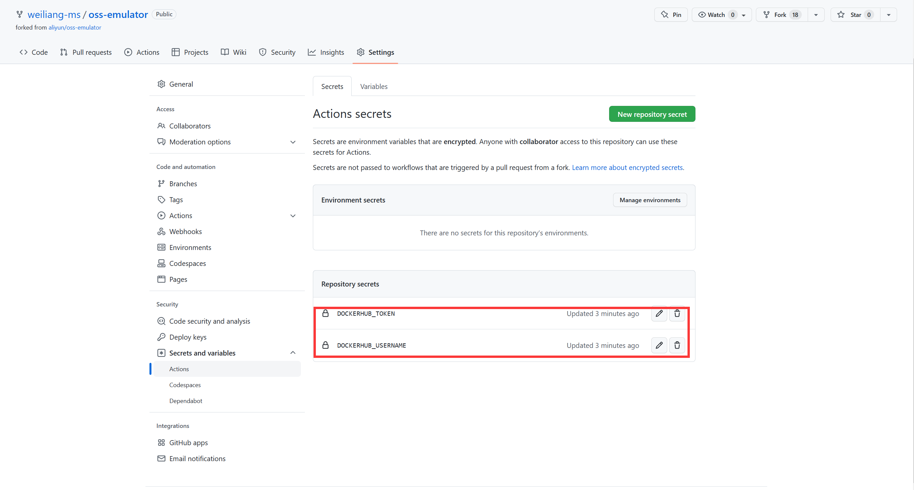

# 基于kubernetes使用阿里云OSS服务

## 背景介绍

离线开发环境需要连接阿里云 OSS 服务， 通过调研我们决定使用 oss-emulator 模拟 OSS 服务。

## 项目介绍

oss-emulator 是阿里开源的轻量级 OSS 服务模拟器，提供与 OSS 服务相同的 API 接口

但该项目仅提供基于 linux 部署方案，不支持容器化，无法满足容器化部署场景


因此，我将 oss-emulator 项目打包成镜像发布到 docker hub，并提供容器化部署方案，便于后续使用。

## 容器化过程及验证

需求依赖：docker hub 账号

1. fork项目


2. 配置 docker hub 账号口令

用于后续 github action 自动构建使用


票据内容如下：



3. 登录 docker hub 创建 oss-emulator 仓库


到此为止，我们准备工作已经完成，接下来就是将项目打包成镜像

4. 项目根新增 Dockerfile ,内容如下

```dockerfile
FROM ruby:alpine
MAINTAINER weiliang-ms@github
WORKDIR /work
ADD . .
RUN gem install thor builder webrick
CMD ["ruby","/work/bin/emulator", "-r", "store", "-p", "8080"]
```

5. 项目根新增 github action 流水线配置

配置路径：.github/workflows/build.yml

配置内容如下：

```yaml
name: ci
on:
  push:
    branches:
      - 'master'
jobs:
  docker:
    runs-on: ubuntu-latest
    steps:
      - uses: actions/checkout@v2
      -
        name: Set up QEMU
        uses: docker/setup-qemu-action@v1
      -
        name: Set up Docker Buildx
        uses: docker/setup-buildx-action@v1
      -
        name: Login to DockerHub
        uses: docker/login-action@v1
        with:
          username: ${{ secrets.DOCKERHUB_USERNAME }}
          password: ${{ secrets.DOCKERHUB_TOKEN }}
      -
        name: Build and push
        uses: docker/build-push-action@v2
        with:
          context: ./
          file: Dockerfile
          push: true
          tags: xzxwl/oss-emulator
```

提交变更后，github action 流水线基于配置进行镜像构建，最终将生成的 xzxwl/oss-emulator 镜像推送至 docker hub

6. 启动 oss-emulator 容器

```shell
$ mkdir -p /work/oss-data
$ docker run -idt --name oss-emulator -p 8080:8080 -v /work/oss-data:/work/store xzxwl/oss-emulator
```

7. 下载 ossutil 测试管理 oss-emulator

下载授权

```shell
$ wget https://gosspublic.alicdn.com/ossutil/1.7.14/ossutil64
$ chmod 755 ossutil64
```

8. 测试 OSS 可用性

测试创建 bucket 功能

```shell
$ ./ossutil64 -e http://127.0.0.1:8080 -i  AccessKeyId -k AccessKeySecret mb oss://bucket-test
0.005875(s) elapsed
```

测试查询 bucket

```shell
$ ./ossutil64 -e http://127.0.0.1:8080 -i  AccessKeyId -k AccessKeySecret ls oss://bucket-test
Object Number is: 0

0.006463(s) elapsed
```

测试上传文件

```shell
$ touch test.file
$ ./ossutil64 -e http://127.0.0.1:8080 -i  AccessKeyId -k AccessKeySecret cp test.file oss://bucket-test/
Succeed: Total num: 1, size: 0. OK num: 1(upload 1 files).

average speed 0(byte/s)

0.014518(s) elapsed
$ ./ossutil64 -e http://127.0.0.1:8080 -i  AccessKeyId -k AccessKeySecret ls oss://bucket-test/
LastModifiedTime                   Size(B)  StorageClass   ETAG                                  ObjectName
2023-01-11 21:56:51 -0500 EST            0      Standard   D41D8CD98F00B204E9800998ECF8427E      oss://bucket-test/test.file
Object Number is: 1

0.008415(s) elapsed
```

该项目并非完全兼容 OSS 接口，仅支持以下接口内容，使用时注意

## 接口兼容性

- *oss-emulator* 支持 `put, get, list, copy, delete, multipart` 等数据操作API接口，支持部分Bucket操作接口。

### Bucket相关接口
- 支持
```
ListBuckets(GetService),PutBucket(CreateBucket),GetBucket,DeleteBucket,
GetBucketLocation,GetBucketInfo,PutBucketACL,GetBucketACL
```

- 不支持
```
PutBucketLogging,PutBucketWebsite,PutBucketReferer,PutBucketLifecycle,
GetBucketLogging,GetBucketWebsite,GetBucketReferer,GetBucketLifecycle,
DeleteBucketLogging,DeleteBucketWebsite,DeleteBucketLifecycle
```

### Object相关接口
- 支持
```
PutObject,CopyObject,AppendObject,GetObject,DeleteObject,DeleteMultipleObjects,
HeadObject,GetObjectMeta,PutObjectACL,GetObjectACL
```

- 不支持
```
PostObject,Callback,PutSymlink,GetSymlink,RestoreObject
```

### Multipart相关接口
- 支持
```
InitiateMultipartUpload,UploadPart,CompleteMultipartUpload
```

- 不支持
```
UploadPartCopy,AbortMultipartUpload,ListMultipartUpload,ListParts
```


## 容器化部署方式

### docker

创建数据持久化目录

```shell
$ mkdir -p /oss-store
```

启动服务

```shell
$ docker run -idt --name oss-emulator -p 8080:8080 --restart=always -v /work/oss-data:/work/store xzxwl/oss-emulator
```

### kubernetes

创建 pvc

```shell
$ cat <<EOF | kubectl apply -f -
kind: PersistentVolumeClaim
apiVersion: v1
metadata:
  name: oss-emulator-volume
  namespace: test
spec:
  accessModes:
    - ReadWriteOnce
  resources:
    requests:
      storage: 50Gi
EOF
```

创建 deployment

```shell
$ cat <<EOF | kubectl apply -f -
kind: Deployment
apiVersion: apps/v1
metadata:
  name: oss-emulator
  namespace: test
  labels:
    app: oss-emulator
spec:
  replicas: 1
  selector:
    matchLabels:
      app: oss-emulator
  template:
    metadata:
      labels:
        app: oss-emulator
    spec:
      volumes:
        - name: host-time
          hostPath:
            path: /etc/localtime
            type: ''
        - name: volume-b5cw22
          persistentVolumeClaim:
            claimName: oss-emulator-volume
      containers:
        - name: container-14y7vu
          image: xzxwl/oss-emulator
          ports:
            - name: http-8080
              containerPort: 8080
              protocol: TCP
          resources:
            limits:
              cpu: 200m
              memory: 400Mi
          volumeMounts:
            - name: host-time
              readOnly: true
              mountPath: /etc/localtime
            - name: volume-b5cw22
              mountPath: /work/store
          imagePullPolicy: IfNotPresent
      restartPolicy: Always
      terminationGracePeriodSeconds: 30
      dnsPolicy: ClusterFirst
      serviceAccountName: default
      serviceAccount: default
      securityContext: {}
      schedulerName: default-scheduler
EOF
```

创建 service

```shell
$ cat <<EOF | kubectl apply -f -
kind: Service
apiVersion: v1
metadata:
  name: oss-emulator-svc
  namespace: test
  labels:
    app: oss-emulator-svc
spec:
  ports:
    - name: http-8080
      protocol: TCP
      port: 80
      targetPort: 8080
  selector:
    app: oss-emulator
EOF
```

此时即可在 kubernetes 内部通过以下地址使用 oss 服务

```
oss-emulator-svc.test:80
```

AK, SK 可以配置如下

```
AK: AccessKeyId
SK: AccessKeySecret
```

对于 xzxwl/oss-emulator 这个镜像，离线环境下可以上传至私有镜像库（例如harbor）进行管理使用