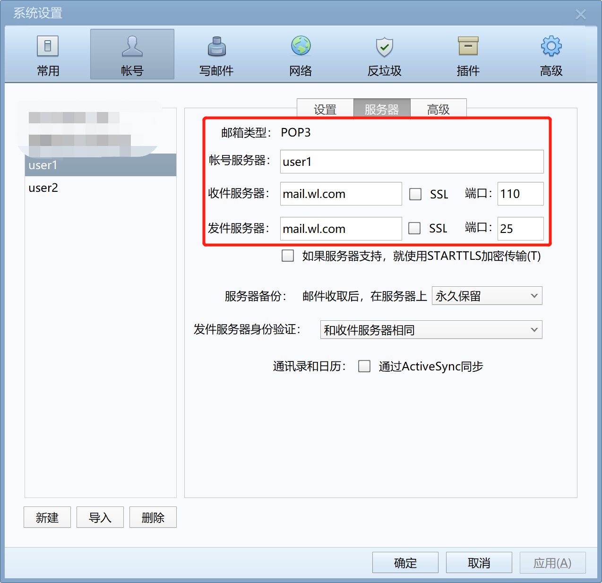
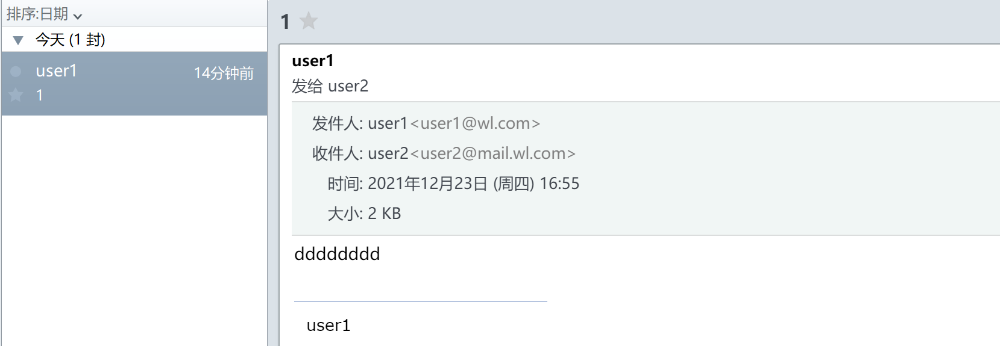
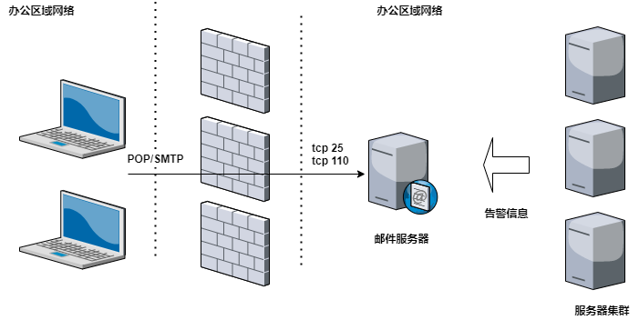

## 搭建配置postfix

> 配置

```shell
$ sudo tee /etc/postfix/main.cf <<EOF
queue_directory = /var/spool/postfix
command_directory = /usr/sbin
daemon_directory = /usr/libexec/postfix
data_directory = /var/lib/postfix
mail_owner = postfix
myhostname = mail.wl.com
mydomain = wl.com
myorigin = \$mydomain
inet_interfaces = all
inet_protocols = all
mydestination = \$myhostname, localhost.\$mydomain, localhost, \$mydomain
#注意这条配置，由于之前是注销的上面一条mydestination = \$myhostname, localhost.\$mydomain, localhost
#导致最后发送邮件时查看maillog报status=bounced (mail for jjonline.com.cn loops back to myself)
#邮件回退给了自己，没有发送出去
unknown_local_recipient_reject_code = 550
mynetworks = 0.0.0.0/0
#这个信任域网段根据自己需求配置，最简单的就是配置0.0.0.0/0 所有网段都可以发送
alias_maps = hash:/etc/aliases
alias_database = hash:/etc/aliases
home_mailbox = Maildir/
smtpd_banner = \$myhostname ESMTP \$mail_name (\$mail_version)
broken_sasl_auth_clients = yes
smtpd_client_restrictions = permit_sasl_authenticated
smtpd_recipient_restrictions = permit_mynetworks, permit_sasl_authenticated, reject_unauth_destination
smtpd_sasl_auth_enable = yes
smtpd_sasl_security_options = noanonymous
message_size_limit = 5242880
smtpd_relay_restrictions = permit_mynetworks,permit_sasl_authenticated,defer_unauth_destination
smtpd_sasl_type = dovecot
#增加了dovecot
smtpd_sasl_path = private/auth
debug_peer_level = 2
debugger_command =
     PATH=/bin:/usr/bin:/usr/local/bin:/usr/X11R6/bin
     ddd \$daemon_directory/\$process_name \$process_id & sleep 5
sendmail_path = /usr/sbin/sendmail.postfix
newaliases_path = /usr/bin/newaliases.postfix
mailq_path = /usr/bin/mailq.postfix
setgid_group = postdrop
html_directory = no
manpage_directory = /usr/share/man
sample_directory = /usr/share/doc/postfix-2.10.1/samples
readme_directory = /usr/share/doc/postfix-2.10.1/README_FILES
EOF
```

启动

```shell
$ systemctl enable postfix --now
```

## 安装cyrus-sasl

`sasl`主要用于邮箱用户名密码认证

1. 安装`sasl`

```shell
$ yum -y install cyrus-sasl
```

2. 配置`sasl`

```shell
$ sudo tee /etc/sysconfig/saslauthd <<EOF
SOCKETDIR=/run/saslauthd
MECH=shadow
FLAGS=
EOF

$ sudo tee /etc/sasl2/smtpd.conf <<EOF
pwcheck_method: saslauthd
mech_list:plain login CRAM-MD5 DIGEST-MD5
log_level: 3
saslauthd_path:/var/run/saslauthd/mux
EOF
```

3. 启动`sasl`

```shell
[root@localhost ~]# service saslauthd start
Redirecting to /bin/systemctl start saslauthd.service
[root@localhost ~]# chkconfig saslauthd on
Note: Forwarding request to 'systemctl enable saslauthd.service'.
Created symlink from /etc/systemd/system/multi-user.target.wants/saslauthd.service to /usr/lib/systemd/system/saslauthd.service.
```

4. 测试`sasl`

```shell
[root@localhost ~]# useradd ilanni &&echo 'ilannimail'| passwd --stdin ilanni
Changing password for user ilanni.
passwd: all authentication tokens updated successfully.
[root@localhost ~]# su - ilanni
[ilanni@localhost ~]$ mkdir -p ~/mail/.imap/INBOX
[ilanni@localhost ~]$ testsaslauthd -u ilanni -p 'ilannimail'
0: OK "Success."
[ilanni@localhost ~]$ exit
[root@localhost ~]# userdel -r ilanni
```

5. 测试`postfix`

```shell
$ yum install -y telnet
```

## 安装dovecot

1. 安装

```shell
$ yum -y install dovecot dovecot-devel dovecot-mysql pam-devel
```

2. 配置

```shell
$ sudo tee /etc/dovecot/dovecot.conf <<EOF
auth_mechanisms = plain login
mbox_write_locks = fcntl
passdb {
    driver = pam
}
service auth {
    unix_listener /var/spool/postfix/private/auth {
        group = postfix
        mode = 0660
        user = postfix
    }
    user = root
}
#ssl_cert = </etc/pki/dovecot/certs/dovecot.pem
#ssl_key = </ect/pki/dovecot/private/dovecot.pem
userdb {
    driver = passwd
}

ssl = no
mail_location = maildir:~/Maildir
disable_plaintext_auth = no
EOF
```

3. 启动

```shell
$ systemctl enable dovecot --now
```

4. 重启`postfix`

```shell
$ systemctl restart postfix
```

5. 查看端口监听

```shell
[root@localhost ~]# ss -aln|grep 25
tcp    LISTEN     0      100       *:25                    *:*
tcp    LISTEN     0      100    [::]:25                 [::]:*
[root@localhost ~]# ss -aln|grep 110
tcp    LISTEN     0      100       *:110                   *:*
tcp    LISTEN     0      100    [::]:110                [::]:*
[root@localhost ~]# ss -aln|grep 143
tcp    LISTEN     0      100       *:143                   *:*
tcp    LISTEN     0      100    [::]:143                [::]:*
```

6. 创建邮件用户

```shell
[root@localhost ~]# useradd user1 &&echo '123456'| passwd --stdin user1
Changing password for user user1.
passwd: all authentication tokens updated successfully.
[root@localhost ~]# useradd user2 &&echo '123456'| passwd --stdin user2
Changing password for user user2.
passwd: all authentication tokens updated successfully.
```

7. 激活用户

```shell
[root@localhost home]# telnet 192.168.1.1 pop3
Trying 192.168.1.1...
Connected to 192.168.1.1.
Escape character is '^]'.
+OK Dovecot ready.
user user1
+OK
pass 123456
+OK Logged in.
quit
+OK Logging out.
Connection closed by foreign host.
[root@localhost home]# ls /home/user1/
.bash_logout   .bash_profile  .bashrc        Maildir/
[root@localhost home]# ls /home/user1/Maildir/
cur  dovecot.index.log  dovecot-uidlist  dovecot-uidvalidity  dovecot-uidvalidity.61c43406  new  tmp
[root@localhost home]# telnet 192.168.1.1 pop3
Trying 192.168.1.1...
Connected to 192.168.1.1.
Escape character is '^]'.
+OK Dovecot ready.
user user2
+OK
pass 123456
+OK Logged in.
quit
+OK Logging out.
Connection closed by foreign host.
[root@localhost home]# ls /home/user2/
.bash_logout   .bash_profile  .bashrc        Maildir/
[root@localhost home]# ls /home/user2/Maildir/
cur  dovecot.index.log  dovecot-uidlist  dovecot-uidvalidity  dovecot-uidvalidity.61c43406  new  tmp
```

## 配置foxmail

1. 配置`host`解析

`C:\Windows\System32\drivers\etc\hosts`

添加解析内容（`192.168.1.1`为邮件服务器`IP`地址）

```
192.168.1.1 mail.wl.com
```

2. 配置`foxmail`

配置信息如下



3. 测试

`user1`与`user2`互发邮件



4. 架构说明

