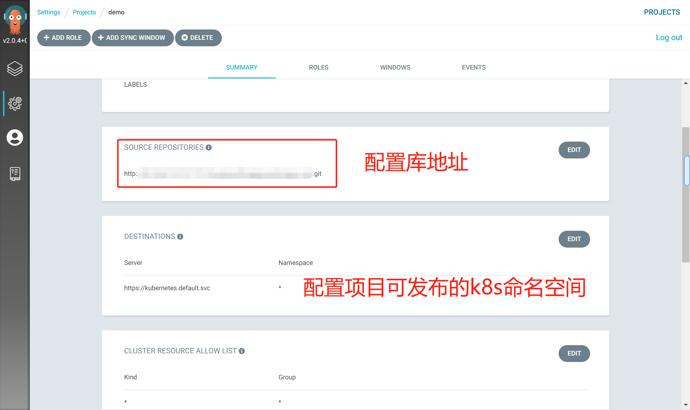

## 实践

通过一个样例来说明，`argocd`是如何结合`gitlab`与`k8s`实现应用的`cicd`流程

关于`argocd`其他部分内容（用户管理、安全审计、自定义`hook`）等内容，这里不做过多讨论

相关技术&工具：

- `gitlab`: 存放源代码与应用清单
- `docker`: 构建镜像&容器运行时
- `harbor`: 镜像制品库，管理镜像
- `jenkins`: `ci`流水线工具
- `k8s`: 容器编排工具
- `argocd`: 基于`k8s`的`cd`工具

### 流程解析

> 代码库变更

开发人员提交代码，触发`jenkins ci pipeline`

> `ci pipeline`执行构建

包含以下步骤：

- 打包构建应用程序
- 构建应用镜像
- 根据`commit id`创建镜像`tag`
- 推送至镜像库
- 变更配置库配置

> 变更配置库配置

`ci pipeline`最后一个流程，执行以下内容：

- `checkout`配置库
- 利用`yq`工具变更配置库内`yaml`清单文件内容（主要为镜像`tag`）
- 提交变更至配置库

> `cd`流程

`argocd`拉取配置库清单文件，比对内容。

文件发生变更 -> 执行变更
文件未发生变更 -> 继续观测配置库变更

### 源码库关键文件

> 源码工程

- `demo`: 基于`spring boot`工程

> `Jenkinsfile`内容

```text
pipeline {

    agent any

    environment {
        DEMO_IMAGE_TAG="harbor.wl.com/library/demo"
        DOCKER_REGISTRY_DOMAIN="harbor.wl.com"
        DOCKER_CREDENTIAL_ID = 'harbor-secret'
        GIT_CREDENTIAL_ID='d145edf3-929c-4efa-aa46-48ea0cf4336e'
        GIT_CONFIG_REPO_URL="192.168.1.1:80/demo-group/demo.git"
    }

    stages {

        stage ('checkout scm') {
            steps {
                checkout(scm)
            }
        }
        
        // 获取git提交的commit id
        stage('get commit id...') {
            steps {
                script {
                    env.GIT_COMMIT_ID = sh (script: 'git rev-parse --short HEAD', returnStdout: true).trim()
                    }   
            }
        }

        // 基于Dockerfile内容构建demo应用镜像，生成两个版本tag：latest && commit id
        stage ('build demo image...') {
            steps {
                sh '''
                    sudo docker build -t $DEMO_IMAGE_TAG -f Dockerfile .
                    sudo docker tag $DEMO_IMAGE_TAG $DEMO_IMAGE_TAG:$GIT_COMMIT_ID
                '''
            }
        }

        // 推送镜像至本地Harbor库，票据有jenkins管理
        stage ('publish image with portal...') {
            steps {
                withCredentials([usernamePassword(passwordVariable : 'DOCKER_PASSWORD' ,usernameVariable : 'DOCKER_USERNAME' ,credentialsId : "$DOCKER_CREDENTIAL_ID" ,)]) {
                        sh 'sudo echo "$DOCKER_PASSWORD" | sudo docker login $DOCKER_REGISTRY_DOMAIN -u "$DOCKER_USERNAME" --password-stdin'
                        sh '''
                        sudo docker push "$DEMO_IMAGE_TAG"
                        sudo docker push "$DEMO_IMAGE_TAG:$GIT_COMMIT_ID"
                        '''
                }
            }
        }

        // checkout 配置库
        stage ('checkout config repo ...') {
            steps {
                checkout([$class: 'GitSCM', branches: [[name: '*/master']], extensions: [], userRemoteConfigs: [[credentialsId: "$GIT_CREDENTIAL_ID", url: "http://${GIT_CONFIG_REPO_URL}"]]])
            }
        }

        // 更改demo-config库下demo/demo.yaml文件内镜像tag
        // 提交更改至demo-config库
        stage ('commit config repo changes ...') {
            steps {
                withCredentials([usernamePassword(credentialsId: "$GIT_CREDENTIAL_ID", passwordVariable: 'GIT_PASSWORD', usernameVariable: 'GIT_USERNAME')]) {
                        sh '''
                        echo "#$GIT_COMMIT_ID#"
                        tag=$DEMO_IMAGE_TAG:$GIT_COMMIT_ID
                        tag=$tag yq eval ".spec.template.spec.containers[0].image = strenv(tag)" -i demo/demo.yaml
                        git add demo/demo.yaml
                        git commit -m "modify version"
                        git config --global push.default simple
                        git push http://$GIT_USERNAME:$GIT_PASSWORD@${GIT_CONFIG_REPO_URL} HEAD:master 
                        '''
                }
            }
        }
    }
}
```

> `Dockerfile`内容

```
FROM harbor.wl.com/library/maven:3.8.1 AS builder
WORKDIR /usr/local
ADD . .
RUN mvn clean package

FROM harbor.wl.com/library/openjdk-1.8:alpine
COPY --from=builder /usr/local/demo/target/demo-0.0.1-SNAPSHOT.jar /opt/app.jar
EXPOSE 8080
```

### 配置库关键文件

> `demo-config`配置库层级及清单内容

- 层级

```
demo-config
└── demo
    ├── demo-svc.yaml
    └── demo.yaml
```

- `demo.yaml`内容：

```yaml
apiVersion: apps/v1
kind: Deployment
metadata:
  name: demo-app
  labels:
    app: demo-app
spec:
  progressDeadlineSeconds: 600
  replicas: 1
  revisionHistoryLimit: 10
  selector:
    matchLabels:
      app: demo-app
  template:
    metadata:
      labels:
        app: demo-app
    spec:
      containers:
        - name: demo-app
          image: harbor.wl.com/library/demo:da28fcb
          imagePullPolicy: Always
          args:
            - java
            - '-Xms2048m'
            - '-Xmx2048m'
            - '-jar'
            - /opt/app.jar
            - '--server.port=8080'
            - '--spring.profiles.active=dev'
          livenessProbe:
            failureThreshold: 10
            httpGet:
              path: /actuator/health
              port: 7002
              scheme: HTTP
            initialDelaySeconds: 30
            periodSeconds: 10
            successThreshold: 1
            timeoutSeconds: 10
          readinessProbe:
            failureThreshold: 10
            httpGet:
              path: /actuator/health
              port: 7002
              scheme: HTTP
            initialDelaySeconds: 30
            periodSeconds: 10
            successThreshold: 1
            timeoutSeconds: 10
          ports:
            - containerPort: 8080
              name: http-8080
              protocol: TCP
      dnsPolicy: ClusterFirst
      restartPolicy: Always
      schedulerName: default-scheduler
      serviceAccount: default
      serviceAccountName: default
      terminationGracePeriodSeconds: 30
```

- `demo-svc.yaml`内容

```yaml
---
apiVersion: v1
kind: Service
metadata:
  name: demo-svc
  labels:
    app: demo-svc
spec:
  ports:
    - name: http-8080
      port: 80
      protocol: TCP
      targetPort: 8080
  selector:
    app: demo-app
  sessionAffinity: None
  type: ClusterIP
```

### harbor库配置信息

配置镜像清理策略，以免垃圾镜像过多


### argocd配置信息

> 配置仓库

`web`控制台进入仓库配置界面


点击`CONNECT REPO USING HTTPS`添加仓库


配置相关信息点击`CONNECT`


查看项目下仓库状态


> 配置集群

点击设置->集群


编辑集群信息，`namespace`值为空（保存后会自动填充为`All namespaces`）


> 创建项目（逻辑分组）

点击设置->项目


创建`demo`项目


配置项目关联的`git`仓库与`k8s`集群信息



> 创建应用

新建应用


配置应用


至此流程配置完毕

### 样例应用

以下展示实际开发项目的`cd`应用

应用关联的资源对象


应用同步信息


