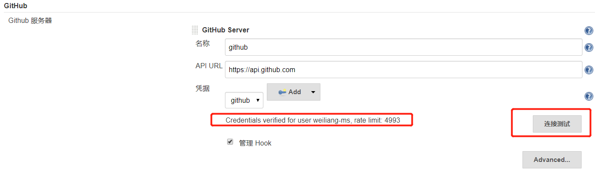

### github生成Tocken

[图片内地址链接](https://github.com/settings/profile)

- 选择`Personal access tokens`

- 选择`Generate new tocken`

- 勾选`repo`与`admin:repo_hook`

- 点击最下方绿色按钮`Generate tocken`，复制该`tocken`

### jenkins配置github Tocken

访问jenkins系统设置页面，找到配置Github 服务器

**生成凭据**

**配置凭据**

**测试连通性**

