<!-- START doctoc generated TOC please keep comment here to allow auto update -->
<!-- DON'T EDIT THIS SECTION, INSTEAD RE-RUN doctoc TO UPDATE -->
**Table of Contents**  *generated with [DocToc](https://github.com/thlorenz/doctoc)*

- [集成部署](#%E9%9B%86%E6%88%90%E9%83%A8%E7%BD%B2)
  - [ftp](#ftp)
  - [Python3.6](#python36)
  - [pdns](#pdns)
  - [poweradmin](#poweradmin)
  - [hadoop](#hadoop)
    - [准备离线资源](#%E5%87%86%E5%A4%87%E7%A6%BB%E7%BA%BF%E8%B5%84%E6%BA%90)
    - [linux节点配置](#linux%E8%8A%82%E7%82%B9%E9%85%8D%E7%BD%AE)
    - [主节点安装Mysql](#%E4%B8%BB%E8%8A%82%E7%82%B9%E5%AE%89%E8%A3%85mysql)
    - [创建cloudera-manager本地镜像源（主节点）](#%E5%88%9B%E5%BB%BAcloudera-manager%E6%9C%AC%E5%9C%B0%E9%95%9C%E5%83%8F%E6%BA%90%E4%B8%BB%E8%8A%82%E7%82%B9)
    - [主节点上传CDH文件](#%E4%B8%BB%E8%8A%82%E7%82%B9%E4%B8%8A%E4%BC%A0cdh%E6%96%87%E4%BB%B6)
    - [安装Cloudera Manager Agent端（所有agent节点）](#%E5%AE%89%E8%A3%85cloudera-manager-agent%E7%AB%AF%E6%89%80%E6%9C%89agent%E8%8A%82%E7%82%B9)
    - [启动CM Server端](#%E5%90%AF%E5%8A%A8cm-server%E7%AB%AF)
  - [trafodion](#trafodion)
    - [CDH集群部署](#cdh%E9%9B%86%E7%BE%A4%E9%83%A8%E7%BD%B2)
    - [环境初始化](#%E7%8E%AF%E5%A2%83%E5%88%9D%E5%A7%8B%E5%8C%96)
    - [安装CDH5.4](#%E5%AE%89%E8%A3%85cdh54)
    - [安装trafodion](#%E5%AE%89%E8%A3%85trafodion)
  - [openjdk](#openjdk)
  - [ntp](#ntp)

<!-- END doctoc generated TOC please keep comment here to allow auto update -->

# 集成部署
## ftp

> 安装ftp

    yum install -y vsftpd
    
> 创建用户

    useradd -s /sbin/nologin ftpuser
    passwd ftpuser
    
    
> 目录赋权

    chown -R ftpuser:ftpuser /data
    
> 配置vsftp服务

    sed -i "s/anonymous_enable=YES/anonymous_enable=NO/g" /etc/vsftpd/vsftpd.conf
    
    cat >> /etc/vsftpd/vsftpd.conf <<EOF
    userlist_deny=NO
    userlist_file=/etc/vsftpd/user_list
    EOF
    
> 添加用户

    cat >  /etc/vsftpd/user_list <<EOF
    ftpuser
    EOF
    
> 启动
    
    systemctl enable vsftpd --now

## Python3.6

    yum install -y python36 python36-pip python36-devel
    
## pdns

> 安装epel源

    yum install -y epel-release
    
> 安装mariadb

    yum -y install mariadb mariadb-server
    
> 启动mariadb

    systemctl enable mariadb --now
    
> 配置mariadb

    mysql_secure_installation
    
依次输入以下内容
    
    Enter current password for root (enter for none):
    -- 回车
    
    Set root password? [Y/n]
    -- Y
    
    New password:
    -- 输入root口令，这里演示用设置为root
    
    Re-enter new password:
    -- 输入上一步设置的root口令进行确认
    
    Remove anonymous users? [Y/n]
    -- 回车
    
    Disallow root login remotely? [Y/n]
    -- 回车
    
    Remove test database and access to it? [Y/n]
    -- 回车
    
    Reload privilege tables now? [Y/n]
    -- 回车
    
> 修改mariadb字符集

修改服务端

    sed -i "s/\[mysqld\]/&\
    \ninit_connect='SET collation_connection = utf8_unicode_ci'\
    \ninit_connect='SET NAMES utf8'\
    \ncharacter-set-server=utf8\
    \ncollation-server=utf8_unicode_ci\
    \nskip-character-set-client-handshake/" /etc/my.cnf
    
修改客户端

    sed -i "s/\[client\]/&\ndefault-character-set=utf8/" /etc/my.cnf.d/client.cnf
    sed -i "s/\[mysql\]/&\ndefault-character-set=utf8/" /etc/my.cnf.d/mysql-clients.cnf
    
> 重启mariadb

    systemctl restart mariadb

> 查看字符集

    mysql -uroot -proot <<EOF
    show variables like "%character%";show variables like "%collation%";
    EOF
    
输出如下：

    Variable_name   Value
    character_set_client    utf8
    character_set_connection        utf8
    character_set_database  utf8
    character_set_filesystem        binary
    character_set_results   utf8
    character_set_server    utf8
    character_set_system    utf8
    character_sets_dir      /usr/share/mysql/charsets/
    Variable_name   Value
    collation_connection    utf8_unicode_ci
    collation_database      utf8_unicode_ci
    collation_server        utf8_unicode_ci
    
> 创建pdns_db

    mysql -uroot -proot <<EOF
    create database poweradmin;
    EOF
    
> 创建pdns用户

    mysql -uroot -proot <<EOF
    GRANT ALL ON poweradmin.* TO 'poweradmin'@'localhost' IDENTIFIED BY 'poweradmin';
    FLUSH PRIVILEGES;
    EOF
    
> 初始化数据

    mysql -u root -proot poweradmin< /usr/share/doc/pdns-backend-mysql-*/schema.mysql.sql

> 安装pdns

    yum install -y pdns.x86_64 pdns-backend-mysql
    
> 配置pdns

    sed -i "s#launch=bind#launch=gmysql\
    \ngmysql-host=localhost\
    \ngmysql-user=powerdns\
    \ngmysql-dbname=pdns_db\
    \ngmysql-password=powerdns#" /etc/pdns/pdns.conf

## poweradmin

> 下载poweradmin

    curl -L https://sourceforge.net/projects/poweradmin/files/poweradmin-2.1.7.tgz/download  -o ./poweradmin-2.1.7.tgz

> 安装lnap

    yum install httpd php  php-common php-curl php-devel php-gd php-pear php-imap php-mcrypt php-mhash  php-mysql php-xmlrpc gettext -y

> 拷贝项目文件

    tar xvf poweradmin-2.1.7.tgz
    cp -r poweradmin-2.1.7/* /var/www/html/
    
> 启动apache

    systemctl enable httpd  --now

> 启动powerdns

    systemctl enable pdns --now
    
> 配置poweradmin

浏览器访问：http://宿主机互联网IP:80/install

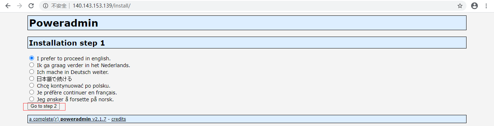

下一步

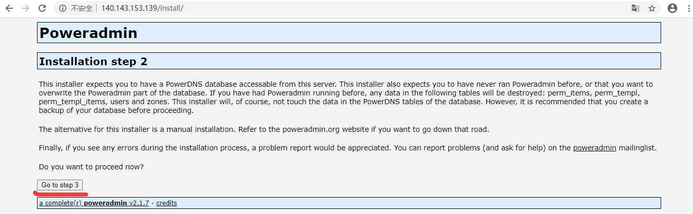

配置数据库信息(全为：poweradmin)

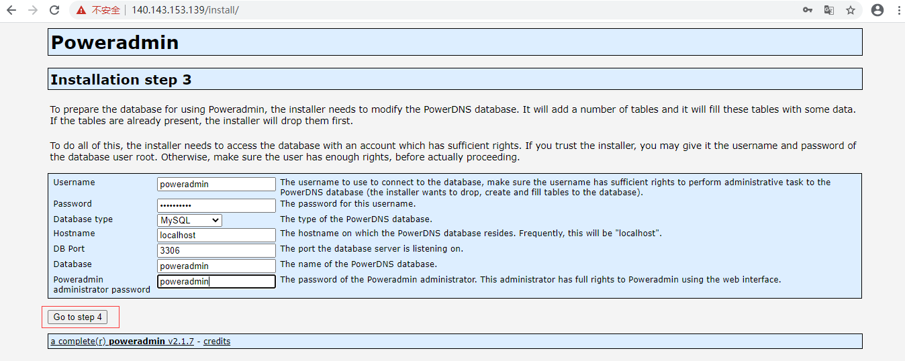

配置如下

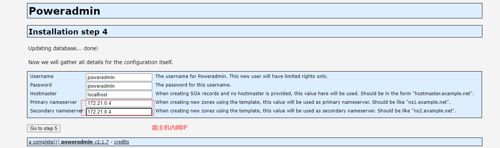

下一步

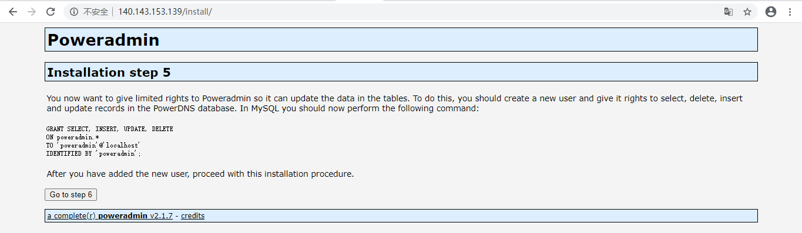

配置`/var/www/html/inc/config.inc.php`

    vim /var/www/html/inc/config.inc.php

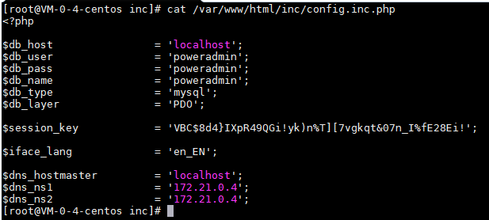
    
内容为web页面红框内容:

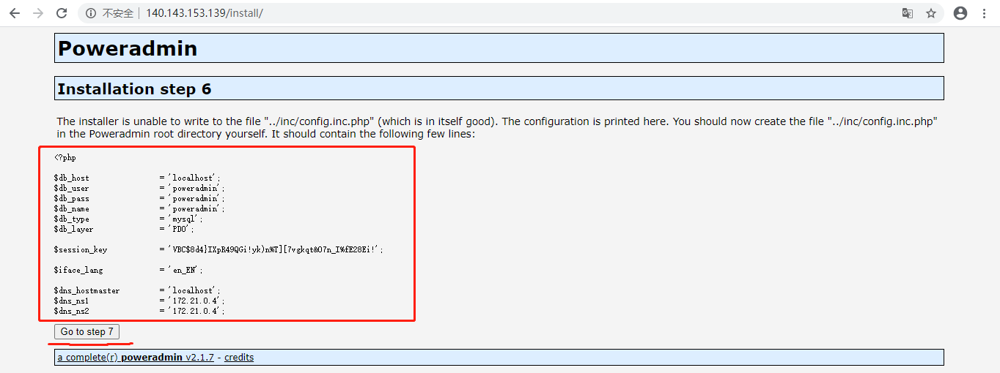

删除`/var/www/html/install/`

    rm -rf /var/www/html/install/
    
访问宿主机80端口，进行登录(admin/poweradmin)

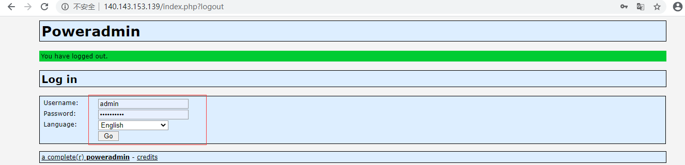

## hadoop

### 准备离线资源

[mysql-connector-java-5.1.48.tar.gz](https://downloads.mysql.com/archives/get/p/3/file/mysql-connector-java-5.1.48.tar.gz)

### linux节点配置

假设节点IP为：

- 主：192.168.1.12

- 从：192.168.1.13

- 从：192.168.1.14

> 设置hostname

节点一执行

    cat >> /etc/sysconfig/network <<EOF
    HOSTNAME=hadoop1
    EOF
    echo hadoop1 >/proc/sys/kernel/hostname
    
节点二执行
    
    cat >> /etc/sysconfig/network <<EOF
    HOSTNAME=hadoop2
    EOF
    echo hadoop2 >/proc/sys/kernel/hostname
    
节点三执行

    cat >> /etc/sysconfig/network <<EOF
    HOSTNAME=hadoop3
    EOF
    echo hadoop3 >/proc/sys/kernel/hostname
    
配置host解析（三个节点均执行，注意IP替换为实际IP）

    cat >> /etc/hosts <<EOF
    192.168.1.12 hadoop1
    192.168.1.13 hadoop2
    192.168.1.14 hadoop3
    EOF

> 关闭防火墙、selinux

    systemctl stop firewalld --now
    setenforce 0
    sed -i "s#SELINUX=enforcing#SELINUX=disabled#g" /etc/selinux/config

> 节点主机互信

master节点执行

    ssh-keygen -t rsa -n '' -f ~/.ssh/id_rsa
    # 根据提示输入对应节点root口令
    ssh-copy-id hadoop1
    ssh-copy-id hadoop2
    ssh-copy-id hadoop3
    
安装oracle jdk（1.8）并配置软链接(oracle jdk安装至/opt/java下)

    mkdir -p /usr/java
    ln -s /opt/java /usr/java/jdk1.8
    
 调整文件句柄数
 
    echo "* soft nofile 655350" >> /etc/security/limits.conf
    echo "* hard nofile 655350" >> /etc/security/limits.conf
    echo "* soft nproc 65535" >> /etc/security/limits.conf
    echo "* hard nproc 65535" >> /etc/security/limits.conf
    ulimit -n 655350

### 主节点安装Mysql

yum安装Marbidb

    yum install mariadb mariadb-server -y
    
启动

    systemctl enable mariadb --now
    
初始化用户、数据库

    mysql -u root <<EOF
    SET PASSWORD FOR 'root'@'localhost'=PASSWORD('root');
    CREATE DATABASE scm_db;
    CREATE USER 'scm_server'@'127.0.0.1' IDENTIFIED BY 'scm_server'; 
    GRANT ALL PRIVILEGES ON scm_db.* TO 'scm_server'@'127.0.0.1';
    FLUSH PRIVILEGES; 
    EOF
    
上传[mysql-connector-java-5.1.48.tar.gz](https://downloads.mysql.com/archives/get/p/3/file/mysql-connector-java-5.1.48.tar.gz)
至`/tmp`目录下，执行以下命令

    mkdir -p /usr/share/java
    tar zxvf mysql-connector-java-5.1.48.tar.gz
    cp mysql-connector-java-5.1.48/mysql-connector-java-5.1.48.jar /usr/share/java/mysql-connector-java.jar
    
初始化CM Server数据库

    /usr/share/cmf/schema/scm_prepare_database.sh mysql scm_db scm_server scm_server -h 127.0.0.1
    
### 创建cloudera-manager本地镜像源（主节点）

安装repo工具

    yum install yum-utils createrepo yum-plugin-priorities -y
    
创建/cm目录，上传安装介质,结构如下

    /cm
    ├── cloudera-manager-agent-5.7.0-1.cm570.p0.76.el7.x86_64.rpm
    ├── cloudera-manager-daemons-5.7.0-1.cm570.p0.76.el7.x86_64.rpm
    ├── cloudera-manager-server-5.7.0-1.cm570.p0.76.el7.x86_64.rpm
    ├── cloudera-manager-server-db-2-5.7.0-1.cm570.p0.76.el7.x86_64.rpm
    ├── enterprise-debuginfo-5.7.0-1.cm570.p0.76.el7.x86_64.rpm
    ├── jdk-6u31-linux-amd64.rpm
    ├── oracle-j2sdk1.7-1.7.0+update67-1.x86_64.rpm
    └── RPM-GPG-KEY-cloudera
    
创建repo源文件

    cd /cm && createrepo ./
    
配置本地cloudera-manager源

    cat > /etc/yum.repos.d/cm.repo <<EOF
    [cloudera-manager]
    name=cm
    baseurl=file:///cm
    gpgkey=file:///cm/RPM-GPG-KEY-cloudera
    enable = 1
    gpgcheck = 1
    EOF
    
### 主节点上传CDH文件

创建目录(server节点、agent节点均需执行)

    mkdir -p /opt/cloudera/parcel-repo
   
上传以下文件至主节点`/opt/cloudera/parcel-repo`下

- [CDH-5.7.2-1.cdh5.7.2.p0.18-el7.parcel]()
- [CDH-5.7.2-1.cdh5.7.2.p0.18-el7.parcel.sha1]()
- [manifest.json]()

生成CDH-5.7.2-1.cdh5.7.2.p0.18-el7.parcel.torrent.sha

    cd /opt/cloudera/parcel-repo
    sha1sum CDH-5.7.2-1.cdh5.7.2.p0.18-el7.parcel.torrent | awk '{print $1}'> CDH-5.7.2-1.cdh5.7.2.p0.18-el7.parcel.torrent.sha
    
修改`CDH-5.7.2-1.cdh5.7.2.p0.18-el7.parcel.sha1`名

    cd /opt/cloudera/parcel-repo
    mv CDH-5.7.2-1.cdh5.7.2.p0.18-el7.parcel.sha1 CDH-5.7.2-1.cdh5.7.2.p0.18-el7.parcel.sha
   
分发至agent节点

    scp /opt/cloudera/parcel-repo/* hadoop2:/opt/cloudera/parcel-repo/
    scp /opt/cloudera/parcel-repo/* hadoop3:/opt/cloudera/parcel-repo/

###安装Cloudera Manager Server端

yum安装cloudera-manager

    yum install cloudera-manager-daemons cloudera-manager-server -y
    
    
### 安装Cloudera Manager Agent端（所有agent节点）

> 拷贝资源文件

主节点拷贝以下内容至agent节点

    scp -r /cm hadoop2:/
    scp -r /cm hadoop3:/
    
    scp /etc/yum.repos.d/cm.repo hadoop2:/etc/yum.repos.d/
    scp /etc/yum.repos.d/cm.repo hadoop3:/etc/yum.repos.d/
    
> 安装agent（agent节点运行）

    yum install cloudera-manager-agent -y
    
> 修改agent配置文件

修改文件`/etc/cloudera-scm-agent/config.ini`以下内容

    server_host=localhost
    # listening_ip
    # listening_hostname=
 
> 启动agent

    systemctl start cloudera-scm-agent
    

### 启动CM Server端

> 启动

    systemctl start cloudera-scm-server
    
> 访问WEB UI （主节点7180端口）

**登录账号：admin/admin**

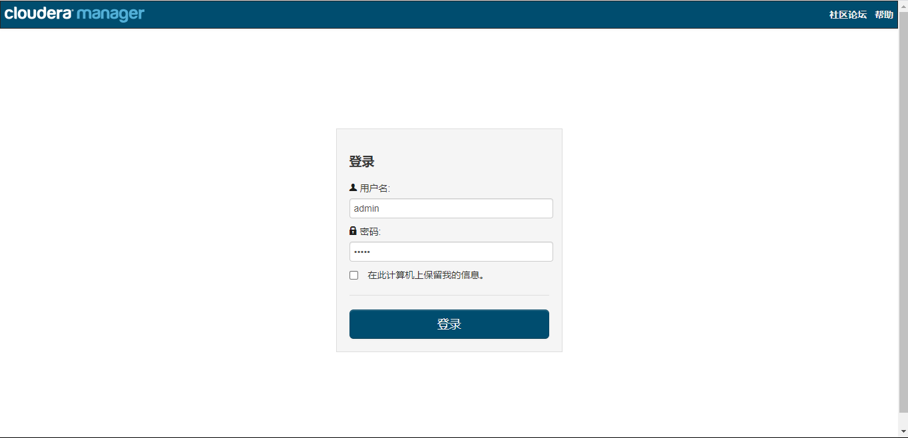    

接受协议

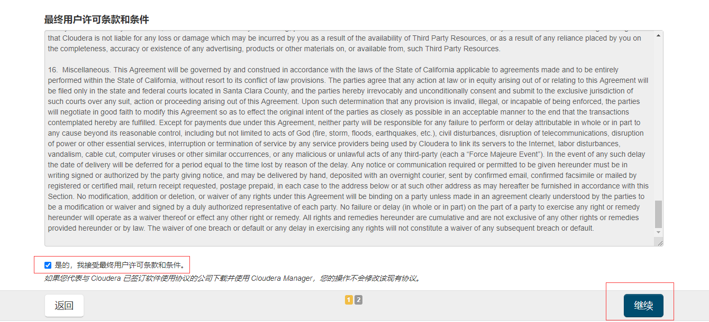 

部署免费版本

 

确认部署应用，点击**继续**

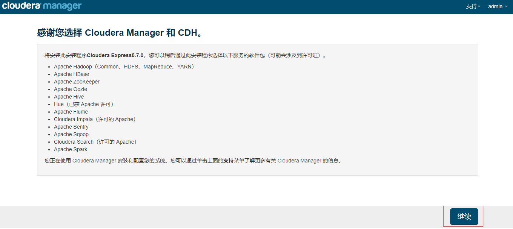 

添加部署节点，点击搜索

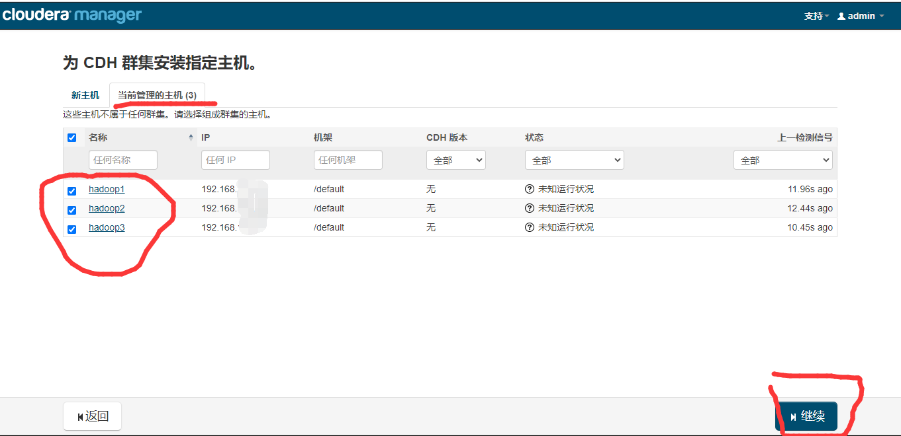

选取节点，继续

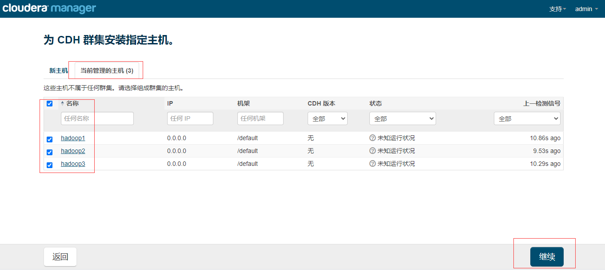

确认cdh版本，继续

## trafodion

### CDH集群部署

**主机列表**

- 192.168.1.11

- 192.168.1.12

- 192.168.1.13

**操作系统（必须）**

- CentOS6

### 环境初始化

> 1.设置hostname，并配置host解析

192.168.1.11主机执行：

    cat >> /etc/sysconfig/network <<EOF
    HOSTNAME=hadoop1
    EOF
    echo hadoop1 >/proc/sys/kernel/hostname
    
    cat >> /etc/hosts <<EOF
    192.168.1.11 hadoop1
    192.168.1.12 hadoop2
    192.168.1.13 hadoop3
    EOF
    
192.168.1.12主机执行：

    cat >> /etc/sysconfig/network <<EOF
    HOSTNAME=hadoop2
    EOF
    echo hadoop2 >/proc/sys/kernel/hostname
    
    cat >> /etc/hosts <<EOF
    192.168.1.11 hadoop1
    192.168.1.12 hadoop2
    192.168.1.13 hadoop3
    EOF
   
192.168.1.13主机执行：

    cat >> /etc/sysconfig/network <<EOF
    HOSTNAME=hadoop3
    EOF
    echo hadoop3 >/proc/sys/kernel/hostname
    
    cat >> /etc/hosts <<EOF
    192.168.1.11 hadoop1
    192.168.1.12 hadoop2
    192.168.1.13 hadoop3
    EOF
    
> 2.安装必要软件

    yum install -y openssh-clients yum-utils createrepo yum-plugin-priorities
    
> 3.实现主机互信（hadoop1节点执行）

hadoop1节点执行以下命令，生成ssh密钥

    ssh-keygen -t rsa -P "" -f ~/.ssh/id_rsa
     
分发密钥完成互信（依次输入各节点密码）

    ssh-copy-id hadoop1
    ssh-copy-id hadoop2
    ssh-copy-id hadoop3
    
> 4.调整系统参数（三个节点均执行）

    # 调整文件句柄数
    echo "* soft nofile 655350" >> /etc/security/limits.conf
    echo "* hard nofile 655350" >> /etc/security/limits.conf
    echo "* soft nproc 65535" >> /etc/security/limits.conf
    echo "* hard nproc 65535" >> /etc/security/limits.conf
    ulimit -n 655350

    # 关闭防火墙
    service iptables stop
    chkconfig iptables off
    
    # 关闭selinux
    setenforce 0
    sed -i "s#SELINUX=enforcing#SELINUX=disabled#g" /etc/selinux/config
    
> 5.安装oracle jdk1.8（所有节点）

[安装oracle jdk1.8](https://github.com/weiliang-ms/deploy/blob/master/jdk/oraclejdk.md),并配置软链接
   
    mkdir -p /usr/java
    ln -s /opt/java /usr/java/jdk1.8
        
> 6.安装mysql，初始化用户

[mysql部署文档](https://github.com/weiliang-ms/deploy/blob/master/mysql/README.md)

创建scm_server用户

    mysql -uroot -proot <<EOF
    create user 'scm_server'@'%' identified by 'scm_server';
    create database scm_server_db DEFAULT CHARACTER SET utf8 COLLATE utf8_general_ci;
    grant all privileges on scm_server_db.* to 'scm_server'@'%' with grant option;
    create user 'hive'@'%' identified by 'hive';
    create database hive DEFAULT CHARACTER SET utf8 COLLATE utf8_general_ci;
    grant all privileges on hive.* to 'hive'@'%' with grant option;
    create user 'oozie'@'%' identified by 'oozie';
    create database oozie DEFAULT CHARACTER SET utf8 COLLATE utf8_general_ci;
    grant all privileges on oozie.* to 'oozie'@'%' with grant option; 
    flush privileges;
    exit
    EOF
    
> 7.安装配置ntp

hadoop1节点执行：

    yum install -y ntp
    service ntpd start
    chkconfig ntpd on
    
    sed -i "s;restrict default kod nomodify notrap nopeer noquery;#restrict default kod nomodify notrap nopeer noquery;g" /etc/ntp.conf
    sed -i "s;restrict -6 default kod nomodify notrap nopeer noquery;#restrict -6 default kod nomodify notrap nopeer noquery;g" /etc/ntp.conf
    sed -i "s#restrict -6 ::1#restrict ::1#g" /etc/ntp.conf
    sed -i "s;server 0.centos.pool.ntp.org iburst;#server 0.centos.pool.ntp.org iburst;g" /etc/ntp.conf
    sed -i "s;server 1.centos.pool.ntp.org iburst;#server 1.centos.pool.ntp.org iburst;g" /etc/ntp.conf
    sed -i "s;server 2.centos.pool.ntp.org iburst;#server 2.centos.pool.ntp.org iburst;g" /etc/ntp.conf
    sed -i "s;server 3.centos.pool.ntp.org iburst;#server 3.centos.pool.ntp.org iburst;g" /etc/ntp.conf
    echo "server 127.127.1.0" >> /etc/ntp.conf
    echo "fudge 127.127.1.0 stratum 10" >> /etc/ntp.conf
    echo "disable monitor" >> /etc/ntp.conf
    echo "restrict default nomodify" >> /etc/ntp.conf
    
hadoop2、hadoop3节点执行：

    yum install -y ntp
    
    sed -i "s;restrict default kod nomodify notrap nopeer noquery;#restrict default kod nomodify notrap nopeer noquery;g" /etc/ntp.conf
    sed -i "s;restrict -6 default kod nomodify notrap nopeer noquery;#restrict -6 default kod nomodify notrap nopeer noquery;g" /etc/ntp.conf
    sed -i "s#restrict -6 ::1#restrict ::1#g" /etc/ntp.conf
    sed -i "s;server 0.centos.pool.ntp.org iburst;#server 0.centos.pool.ntp.org iburst;g" /etc/ntp.conf
    sed -i "s;server 1.centos.pool.ntp.org iburst;#server 1.centos.pool.ntp.org iburst;g" /etc/ntp.conf
    sed -i "s;server 2.centos.pool.ntp.org iburst;#server 2.centos.pool.ntp.org iburst;g" /etc/ntp.conf
    sed -i "s;server 3.centos.pool.ntp.org iburst;#server 3.centos.pool.ntp.org iburst;g" /etc/ntp.conf
    echo "server hadoop1" >> /etc/ntp.conf
    echo "disable monitor" >> /etc/ntp.conf
    echo "restrict default nomodify" >> /etc/ntp.conf
    ntpdate hadoop1
    
> 8.下载mysql驱动（hadoop1节点）

下载[mysql-connector-java-5.1.48.tar.gz](https://downloads.mysql.com/archives/get/p/3/file/mysql-connector-java-5.1.48.tar.gz)上传至hadoop1:/tmp下

执行以下命令，调整名称

    mkdir -p /usr/share/java
    tar zxvf mysql-connector-java-5.1.48.tar.gz
    cp mysql-connector-java-5.1.48/mysql-connector-java-5.1.48.jar /usr/share/java/mysql-connector-java.jar

### 安装CDH5.4

> 1.创建离线镜像源目录（所有节点）

    mkdir -p /cm
    
下载[cloudera-manager](http://archive.cloudera.com/cm5/redhat/6/x86_64/cm/5.4.0/RPMS/x86_64/)下的所有文件，并上传至/cm下

> 2.配置cm源（所有节点）

创建repo源文件

    cd /cm && createrepo ./
    cat > /etc/yum.repos.d/cm.repo <<EOF
    [cloudera-manager]
    name=cm
    baseurl=file:///cm
    gpgkey=file:///cm/RPM-GPG-KEY-cloudera
    enable = 1
    gpgcheck = 1
    EOF

`/cm`目录最终结构如下：

    /cm
    ├── cloudera-manager-agent-5.4.0-1.cm540.p0.165.el6.x86_64.rpm
    ├── cloudera-manager-daemons-5.4.0-1.cm540.p0.165.el6.x86_64.rpm
    ├── cloudera-manager-server-5.4.0-1.cm540.p0.165.el6.x86_64.rpm
    ├── cloudera-manager-server-db-2-5.4.0-1.cm540.p0.165.el6.x86_64.rpm
    ├── enterprise-debuginfo-5.4.0-1.cm540.p0.165.el6.x86_64.rpm
    ├── jdk-6u31-linux-amd64.rpm
    ├── oracle-j2sdk1.7-1.7.0+update67-1.x86_64.rpm
    ├── repodata
    │   ├── 3a8b6a8a03c3846eadd0f0d8df2ef1142e6e32d21ce7e4e58a304ad3bef8b5b7-primary.sqlite.bz2
    │   ├── 853ca50d5d1f076b5f53cd06ed4d74c62ee729af1a86e3caa1bd39aaf6e68cf7-other.sqlite.bz2
    │   ├── a6b67b1228bbb6791eb66fd52cfc2044a681a9444e1a1aa044111029b6f4760c-filelists.xml.gz
    │   ├── b05946fbbf3fec9e107640249a183e7109d0e336ef23fcbe199b3dd1743f84f3-other.xml.gz
    │   ├── c2c48ea8c58913116c14e8ec853d2fd2731bee779edafc81dec0d60771709f17-filelists.sqlite.bz2
    │   ├── fd1f07dacbe9d5e3be1e7f7930fbb6eac4d29a75c172c2a31e6e18baa56b5fee-primary.xml.gz
    │   └── repomd.xml
    └── RPM-GPG-KEY-cloudera
    
> 3.安装cloudera-manager-server(hadoop1节点)

    yum install cloudera-manager-daemons cloudera-manager-server -y
    
> 4.安装cloudera-manager-agent(hadoop1、hadoop2、hadoop3节点)

    yum install cloudera-manager-agent -y
    
> 5.修改cloudera-manager-agent配置文件(hadoop1、hadoop2、hadoop3节点)

hadoop1、hadoop2、hadoop3节点执行：

    sed -i "s#server_host=localhost#server_host=hadoop1#g" /etc/cloudera-scm-agent/config.ini
    echo "listening_ip=`hostname`" >> /etc/cloudera-scm-agent/config.ini
    echo "listening_hostname=`hostname`" >> /etc/cloudera-scm-agent/config.ini

> 6.创建CDH离线源仓储

创建目录(hadoop1节点)
    
        mkdir -p /opt/cloudera/parcel-repo
       
上传以下文件至hadoop1节点`/opt/cloudera/parcel-repo`下

- [manifest.json](http://archive.cloudera.com/cdh5/parcels/5.4.0/manifest.json)
- [CDH-5.4.0-1.cdh5.4.0.p0.27-el6.parcel](http://archive.cloudera.com/cdh5/parcels/5.4.0/CDH-5.4.0-1.cdh5.4.0.p0.27-el6.parcel)
- [CDH-5.4.0-1.cdh5.4.0.p0.27-el6.parcel.sha1](http://archive.cloudera.com/cdh5/parcels/5.4.0/CDH-5.4.0-1.cdh5.4.0.p0.27-el6.parcel.sha1)

调整CDH-5.4.0-1.cdh5.4.0.p0.27-el6.parcel.sha1名称

    cd /opt/cloudera/parcel-repo
    mv CDH-5.4.0-1.cdh5.4.0.p0.27-el6.parcel.sha1 CDH-5.4.0-1.cdh5.4.0.p0.27-el6.parcel.sha
    
> 7.初始化CM Server数据库(hadoop1节点)

    /usr/share/cmf/schema/scm_prepare_database.sh mysql scm_server_db scm_server scm_server -h 127.0.0.1
    
> 8.启动cloudera-manager-agent（hadoop1、hadoop2、hadoop3节点）

    service cloudera-scm-agent start
    chkconfig cloudera-scm-agent on

> 9.启动cloudera-manager-server(hadoop1节点)

    service cloudera-scm-server start
    chkconfig cloudera-scm-server on
    
查看日志

    tail -200f /var/log/cloudera-scm-server/cloudera-scm-server.log
    
> 10.访问控制台初始化

主要hadoop1替换为实际IP地址

访问http://hadoop1:7180，账号密码: admin/admin

部署免费版本

 

确认部署应用，点击**继续**

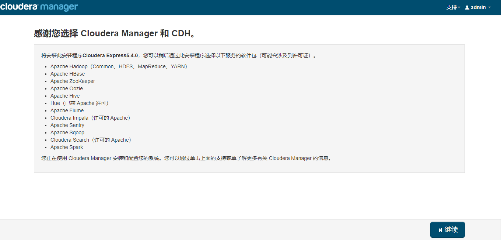 

添加部署节点，点击继续

确认cdh版本，继续

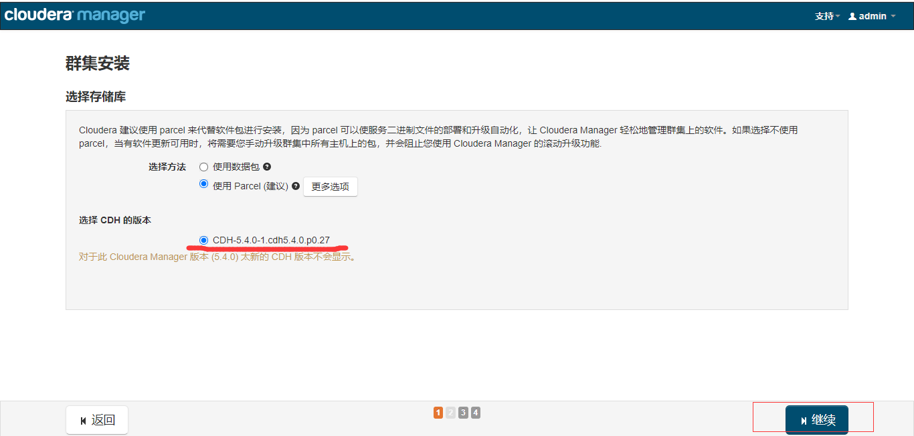

确认安装完成，点击继续

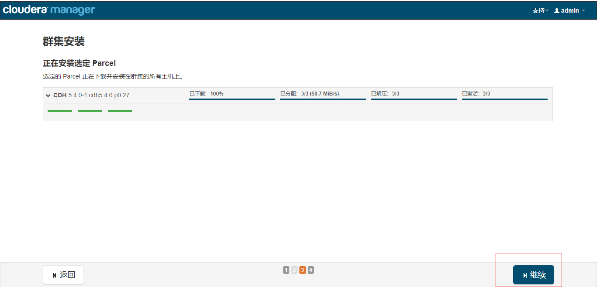

确认检测结果，点击完成

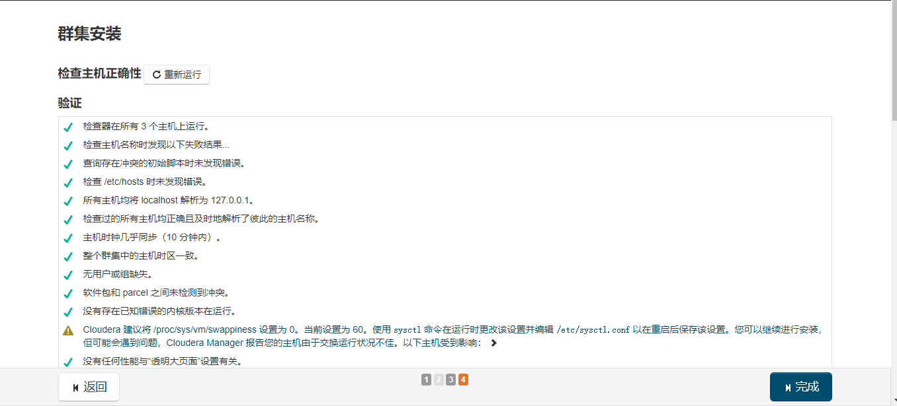

选取hbase内核hadoop安装

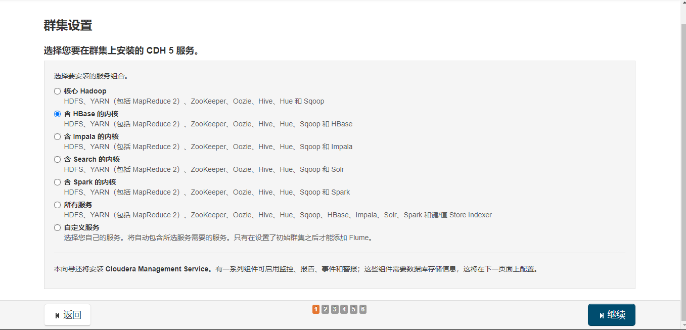

默认角色分配，继续

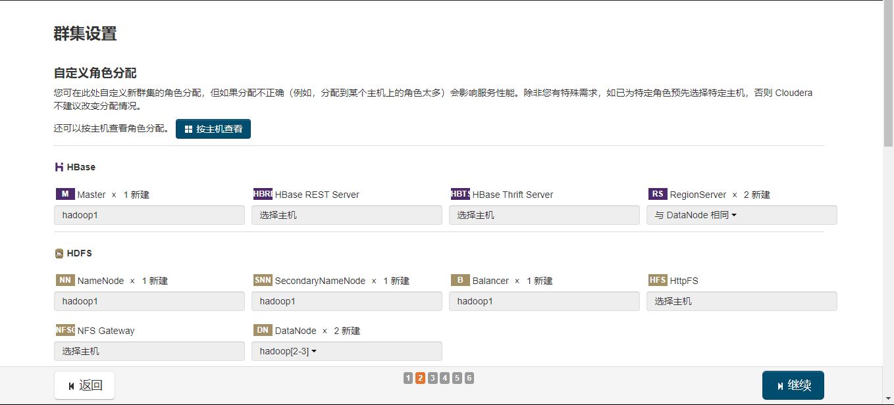

输入用户名密码数据库实例名，测试连接后点击继续

hive/hive hive
oozie/oozie oozie

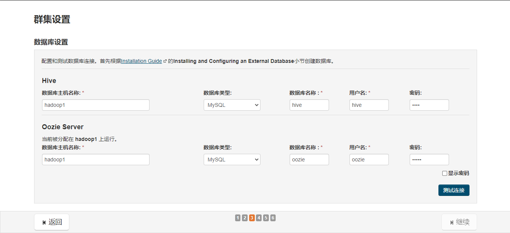
    
确认审核设置，点击继续

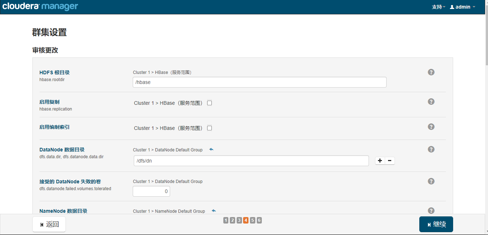

安装完成

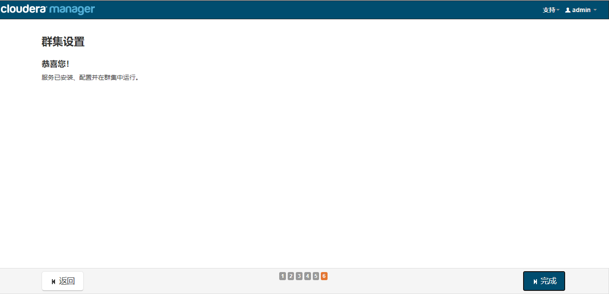

### 安装trafodion

**主机列表**

- 192.168.1.11

- 192.168.1.12

- 192.168.1.13

> 1.下载安装介质及脚本

互联网下载地址:

- [installer](https://archive.apache.org/dist/trafodion/apache-trafodion-2.1.0-incubating/bin/apache-trafodion_installer-2.1.0-incubating.tar.gz)
- [trafodion_server](https://archive.apache.org/dist/trafodion/apache-trafodion-2.1.0-incubating/bin/apache-trafodion_server-2.1.0-RH6-x86_64-incubating.tar.gz)

> 2.创建/trafodion目录，上传安装介质及脚本至该目录下

目录结构如下：

    /trafodion/
    ├── apache-trafodion_installer-2.1.0-incubating.tar.gz
    └── apache-trafodion_server-2.1.0-RH6-x86_64-incubating.tar.gz

> 3.解压运行安装脚本

    cd /trafodion
    tar zxvf apache-trafodion_pyinstaller-2.1.0-incubating.tar.gz
    cd python-installer
    ./db_install.py
    
> 4.按提示输入相关信息

    Enter HDP/CDH web manager URL:port, (full URL, if no http/https prefix, default prefix is http://):
    -- 输入 http://192.168.1.11:7180
    
    Enter HDP/CDH web manager user name [admin]:
    -- 回车默认
    
    Enter HDP/CDH web manager user password:
    -- 输入 admin
    
    Confirm Enter HDP/CDH web manager user password:
    -- 输入 admin
    
    Enter full path to Trafodion tar file:
     -- 输入 /trafodion/apache-trafodion_server-2.1.0-RH6-x86_64-incubating.tar.gz
    
    Enter directory name to install trafodion to [apache-trafodion-2.1.0]:
    -- 回车默认
    
    Enter trafodion user password:
    -- 输入 trafodion
    
    Enter number of DCS client connections per node [4]:
    -- 回车默认
    
    Enter trafodion scratch file folder location(should be a large disk),
    if more than one folder, use comma seperated [$TRAF_HOME/tmp]:
    -- 回车默认
    
    Start instance after installation (Y/N)  [Y]:
    -- 回车默认
    
    Enable LDAP security (Y/N)  [N]:
    -- 回车默认
    
    Enable DCS High Avalability (Y/N)  [N]:
    -- 回车默认
    
    Enter Hadoop admin password, default is [admin]:
    -- 回车默认
    
    Confirm result (Y/N) [N]:
    -- 输入 Y
    
安装过程

安装完毕

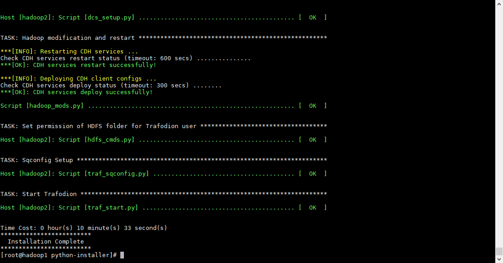

> 5.查看trafodion状态

登录hadoop2，切换到trafodion用户执行以下语句：

    sqcheck

返回如下，说明成功

    *** Checking Trafodion Environment ***
    
    Checking if processes are up.
    Checking attempt: 1; user specified max: 2. Execution time in seconds: 0.
    
    The Trafodion environment is up!
    
    
    Process         Configured      Actual      Down
    -------         ----------      ------      ----
    DTM             2               2
    RMS             4               4
    DcsMaster       1               1
    DcsServer       2               2
    mxosrvr         8               8
    RestServer      1               1
    
## openjdk

    yum install -y java-1.8.0-openjdk.x86_64
    
## ntp

    yum -y install ntpdate
    
    /usr/sbin/ntpdate ntp1.aliyun.com
    echo "*/5 * * * * /usr/sbin/ntpdate ntp1.aliyun.com" >> /etc/crontab