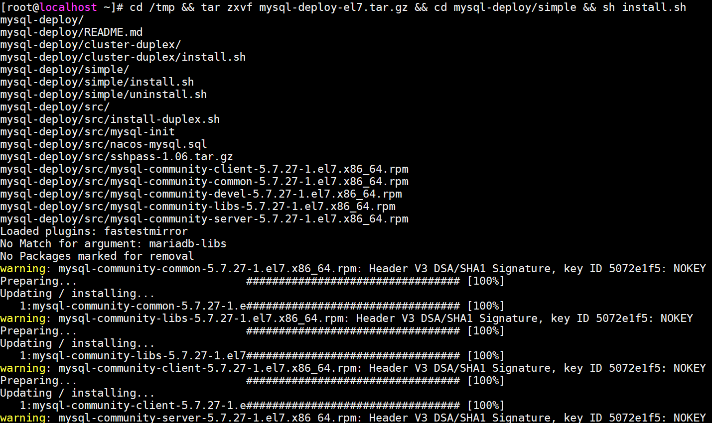
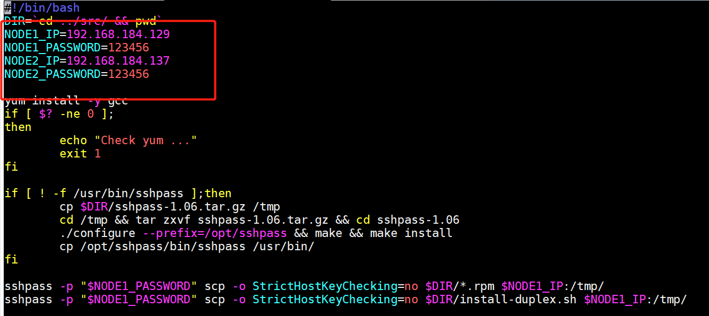
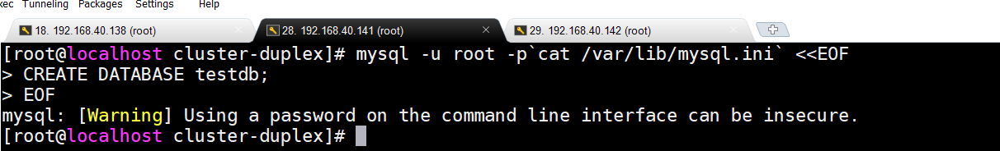

## 集成部署

### 单机集成部署

`适用于CentOS Red Hat`

> 版本信息

	5.7.27社区版

> 配置yum源

	配置基础yum源即可无需epel源

> 下载安装包

	#el6
	http://192.168.131.211:8888/download/software/mysql/mysql-deploy-el6.tar.gz
	
	#el7
	http://192.168.131.211:8888/download/software/mysql/mysql-deploy-el7.tar.gz

> 上传安装

	#上传至/tmp下（如是el6版本注意替换文件名）
	cd /tmp && tar zxvf mysql-deploy-el7.tar.gz && cd mysql-deploy/simple && sh install.sh

> root口令

	cat /var/lib/mysql.ini

> 数据备份

	默认同机备份，备份目录为:
	/var/lib/mysql/bakup
	备份天数为:
	7天

	备份脚本：
	/usr/local/bin/mysql-bakup

### 集群集成部署

`适用于CentOS Red Hat`

`双节点互为主备模式`

> 版本信息

	5.7.27社区版

> 配置yum源

	配置基础yum源即可无需epel源

> 下载安装包

	#el6
	http://192.168.131.211:8888/download/software/mysql/mysql-deploy-el6.tar.gz
	
	#el7
	http://192.168.131.211:8888/download/software/mysql/mysql-deploy-el7.tar.gz

> 上传安装

	#上传至集群中的一个节点/tmp下（如是el6版本注意替换文件）
	cd /tmp && tar zxvf mysql-deploy-el7.tar.gz && cd mysql-deploy/cluster

	#配置mysql集群IP与root口令
	vim install.sh

	#安装
	sh install.sh

> root口令

	#两个节点的root口令并不一致
	cat /var/lib/mysql.ini

> 验证是否同步

	#选取集群中一个节点，获取root口令登陆，创建一个数据库实例
	mysql -u root -p`cat /var/lib/mysql.ini` <<EOF
	CREATE DATABASE testdb;
	EOF

	#登陆另一节点查看是否存在testdb
	mysql -u root -p`cat /var/lib/mysql.ini`
	show databases;
	quit

> 数据备份

	默认同机备份，备份目录为:
	/var/lib/mysql/bakup
	备份天数为:
	7天

	备份脚本：
	/usr/local/bin/mysql-bakup