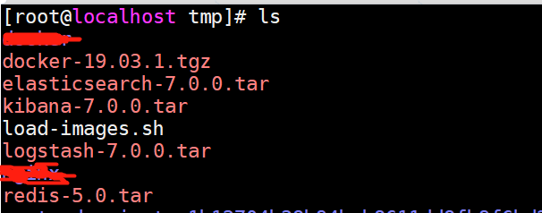
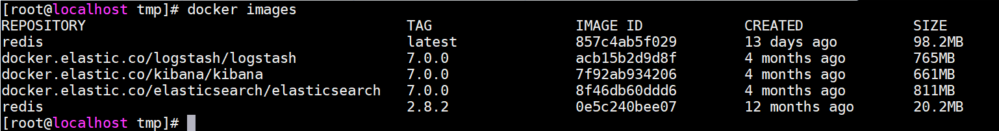
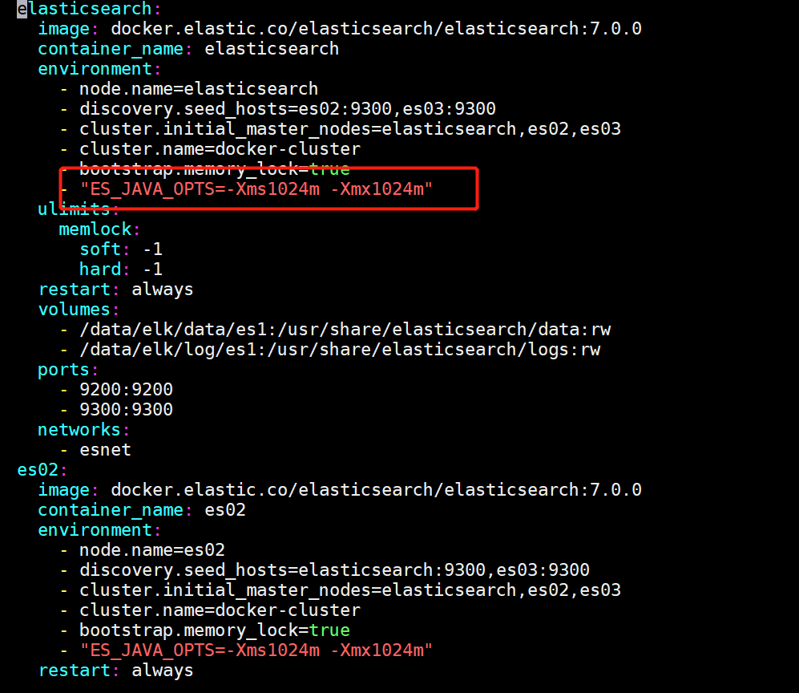
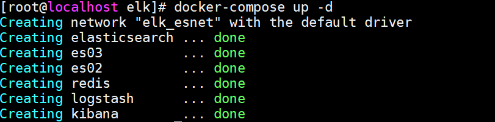
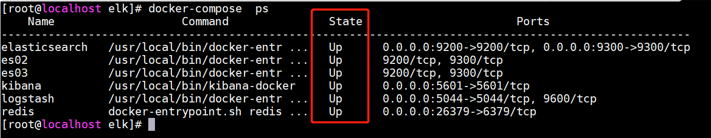

## 容器化elk ##

`需要docker、docker-compose环境 && 确保docker已经安装`

**docker安装文档**

[http://192.168.131.211:8888/docsify/#/deploy/operations/docker?id=docker%e5%ae%89%e8%a3%85](http://192.168.131.211:8888/docsify/#/deploy/operations/docker?id=docker%e5%ae%89%e8%a3%85)

**docker-compose安装文档**

[http://192.168.131.211:8888/docsify/#/deploy/operations/docker?id=docker-compose%e5%ae%89%e8%a3%85](http://192.168.131.211:8888/docsify/#/deploy/operations/docker?id=docker-compose%e5%ae%89%e8%a3%85)

### 部署elk服务端 ###

**分析处理日志**

> 下载导入资源包

	#下载地址
	http://192.168.131.211:8888/download/software/elk/docker/elasticsearch-7.0.0.tar
	http://192.168.131.211:8888/download/software/elk/docker/kibana-7.0.0.tar
	http://192.168.131.211:8888/download/software/elk/docker/logstash-7.0.0.tar
	http://192.168.131.211:8888/download/software/elk/docker/redis-5.0.tar
	http://192.168.131.211:8888/download/software/elk/docker/load-images.sh

	#上传文件至同一目录，建议/tmp下，执行以下命令进行导入
	cd /tmp && sh load-images.sh

> 查看镜像是否导入

	docker images

> 修改系统参数

	sysctl -w vm.max_map_count=262144
	echo "vm.max_map_count = 262144" >> /etc/sysctl.conf

> 下载elk初始化脚本

	http://192.168.131.211:8888/download/software/elk/docker/elk-deploy.tar.gz

> 上传/tmp并运行以下命令

	cd /tmp && tar zxvf elk-deploy.tar.gz
	cd elk-deploy && sh init-elk.sh

> 启动服务端

**最少4g可用内存，否则调整/data/elk/docker-compose.yml中内存设置，且两者数值必须一致**

	cd /data/elk/ && docker-compose up -d

> 查看elk启动日志

	cd /data/elk/ && docker-compose logs -f

> 查看容器状态

	docker-compose ps 

                                    
	

	