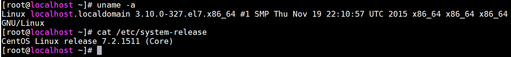
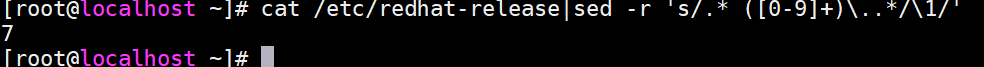
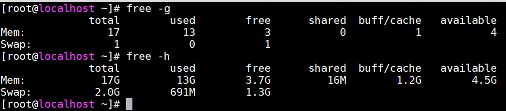
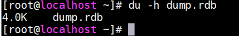
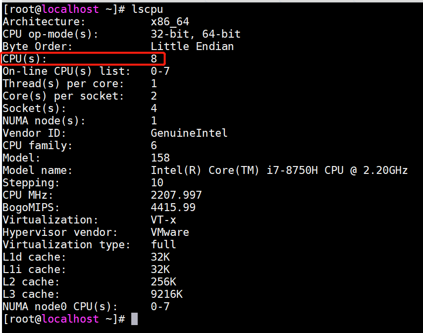
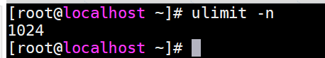

## 常用命令 ##

### 系统信息 ###

> 0.查看系统版本

	cat /etc/system-release
    uname -a

> 1.查看红帽系统主版本号

**适用于红帽系列系统**

	cat /etc/redhat-release|sed -r 's/.* ([0-9]+)\..*/\1/'

> 2.查看内存
	
	#单位为g
	free -h
	#单位为m
	free -m

> 3.查看磁盘

	df -h

> 4.查看文件大小

	du -h 文件名

> 5.查看CPU

	lscpu

> 6.查看系统最大文件打开数

	ulimit -n

## yum配置 ##

`CentOS` `yum`

### 阿里yum源 ###

**适用于**

`主机可以直连外网、或可以通过代理访问外网`

> 1、查看操作系统

	cat /etc/system-release

> 2、下载阿里yum源文件

	CentOS 5
	http://mirrors.aliyun.com/repo/Centos-5.repo

	CentOS 6
	http://mirrors.aliyun.com/repo/Centos-6.repo

	CentOS 7
	http://mirrors.aliyun.com/repo/Centos-7.repo

> 3、删除原有yum源repo文件

	cd /etc/yum.repos.d && rm -f *.repo

> 4、上传阿里yum源文件

	#选取对应版本的操作系统repo文件，上传至以下目录
	/etc/yum.repos.d

> 5、测试网络连通性

	ping 114.114.114.114
	ping mirrors.aliyun.com

	#情况一：ping通ip ping不通域名，执行以下命令添加DNS
	echo "nameserver 114.114.114.114" >> /etc/resolv.conf

	#情况二：ping不通ip ping不通域名，如果是外网机器，说明没有网络权限，需要申请/开通以下权限

	外网主机x.x.x.x 需要访问以下地址：
	mirrors.aliyun.com
	mirrors.aliyuncs.com
	mirrors.cloud.aliyuncs.com

	#情况三：ping不通ip ping不通域名，如果是内网机器，如果有代理（假设外网squid代理）且能访问，执行以下命令，注意IP、端口进行替换
	echo "proxy=http://127.0.0.1:3128" >> /etc/yum.conf

> 6、测试

	yum clean all && yum makecache
	yum install -y telnet vim
	
### 本地yumy源 ###

**适用于**

`主机不可以直连外网、且不可以通过代理访问外网`

> 1、查看操作系统

	cat /etc/system-release

> 2、获取系统安装镜像

	#DVD版或Everything版本

	#1、获取方式一：找系统运维管理员提供，推荐
	让系统管理员帮挂载到/media 或 上传至 /root下

	#2、获取方式二：自己下载，不推荐，文件大小一般4G左右，小版本一定要匹配！
	官方下载地址：https://wiki.centos.org/Download

> 3、上传挂载

	#注意路径、文件名需要替换，以下命令相当于将CentOS-7-x86_64-DVD-1511.iso，解压到/media
	mount -o loop ~/CentOS-7-x86_64-DVD-1511.iso /media

> 4、卸载、拷贝、删除

	mkdir -p /yum && cp -r /media/* /yum/
	unmout /media

> 5、删除原有yum源repo文件

	cd /etc/yum.repos.d && rm -f *.repo

> 6、新建yum repo文件

	cat >> /etc/yum.repos.d/c7.repo <<EOF
	[c7repo]
	
	name=c7repo
	
	baseurl=file:///yum
	
	enabled=1
	
	gpgcheck=0
	
	gpgkey=file:///etc/pki/rpm-gpg/RPM-GPG-KEY-CentOS-7
	EOF

> 7、测试

	yum clean all && yum makecache
	yum install -y telnet vim

## 防火墙配置 ##

### linux6 ###

**适用于`CentOS6 RedHat6`**

> 1.防火墙开放端口

	#开放端口（7777）
	iptables -I INPUT -p tcp -m state --state NEW -m tcp --dport 7777 -j ACCEPT
    #保存
    /etc/rc.d/init.d/iptables save
    #重载
    service iptables restart

> 2.关闭防火墙

**如果仅仅是为了开放端口，建议采用【1.防火墙开放端口】**

	#临时关闭防火墙服务，并关闭防火墙开机自启动
	service iptables stop
	chkconfig iptables off

> 3.开启防火墙

	#开启防火墙服务，并设置防火墙开机自启动
	service iptables start
	chkconfig iptables on

> 4.关闭selinux

	setenforce 0
	sed -i "s#SELINUX=enforcing#SELINUX=disabled#g" /etc/selinux/config

### linux7 ###

**适用于`CentOS6 RedHat7`**

> 1.防火墙开放端口

	firewall-cmd --zone=public --add-port=7777/tcp --permanent
	#重新载入
	firewall-cmd --reload

> 2.关闭防火墙

**如果仅仅是为了开放端口，建议采用【1.防火墙开放端口】**

	#临时关闭防火墙服务，并关闭防火墙开机自启动
	systemctl stop firewalld.service
	systemctl disable firewalld.service

> 3.开启防火墙

	#开启防火墙服务，并设置防火墙开机自启动
	systemctl start firewalld.service
	systemctl enable firewalld.service

> 4.关闭selinux

	setenforce 0
	sed -i "s#SELINUX=enforcing#SELINUX=disabled#g" /etc/selinux/config

	

	

