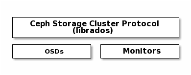
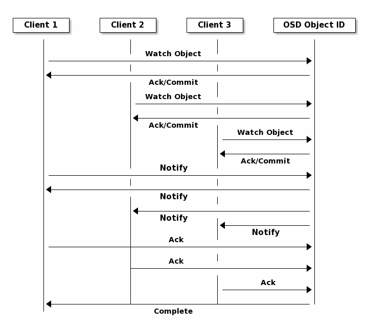

## Ceph协议

`Ceph`客户端使用原生协议与`Ceph`存储集群进行交互，`Ceph`将这个功能打包到`librados`库中。
下图描述了基本架构：

### `Ceph`协议与`librados`

现代应用程序需要一个具有异步通信功能的简单对象存储接口。
`Ceph`存储集群提供了一个具有异步通信能力的简单对象存储接口。
该接口提供了对整个集群中的对象的直接、并行访问。如：

- 池操作
- 快照和写时复制克隆
- 读/写对象-创建或删除-整个对象或字节范围-追加或截断
- 创建/设置/获取/删除`XATTRs`
- 创建/设置/获取/删除键值对
- 复合运算与双ack语义
- 对象类

### 对象观测通知

客户端可以持久性观测一个对象，并保持与主`OSD`的会话处于打开状态。
客户端可以向所有观察者发送通知消息和有效负载，并在观察者收到通知时接收通知。
这使客户端能够将任何对象用作同步/通信通道

