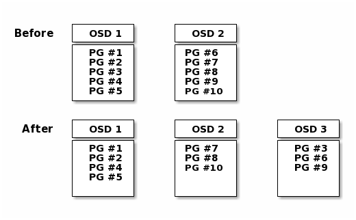

## 动态集群管理

每个池（pool）都有许多放置组（PG），`CRUSH`动态地将`PGs`映射到`OSDs`。当`Ceph`客户端存储对象时，`CRUSH`将每个对象映射到放置组

将对象映射到放置组将在`ceph osd`守护进程和`Ceph`客户端之间创建一个间接层。
`Ceph`存储集群必须能够增长(或收缩)，并重新平衡动态存储对象的位置。
如果`Ceph`客户端“知道”哪个`ceph osd`守护进程有哪个对象，那么`Ceph`客户端和`ceph osd`守护进程之间就会产生一个紧密耦合。
相反，`CRUSH`算法将每个对象映射到一个放置组，然后将每个放置组映射到一个或多个`ceph osd`守护进程。
这一间接层允许`Ceph`在新的`ceph osd`守护进程和底层`OSD`设备上线时动态重新平衡。下图描述了`CRUSH`如何将对象映射到放置组，以及将放置组映射到OSD。

有了集群映射的副本和`CRUSH`算法，客户端就可以准确地计算出在读写特定对象时应该使用哪个`OSD`。

> 计算放置组ID

当`Ceph`客户端绑定到`Ceph mon`时，它将检索集群映射的最新副本。通过集群映射，客户获取集群中的所有`mon`、`OSD`和`mds`信息。但是，它对对象位置一无所知。

**计算过程**

。这很简单:`Ceph`将数据存储在命名池中(例如，“liverpool”)。
当客户端想要存储一个命名对象(例如，“john”、“paul”、“george”、“ringo”等)时，它使用对象名、哈希码、池中的`PGs`数量和池名计算放置组。`Ceph`客户端使用以下步骤计算`PG id`。

- 1、客户端输入对象`ID`和`pool`

- 2、`Ceph`获取对象`ID`并对其进行哈希运算

- 3、`Ceph`计算`pg`数的哈希模,（例如，58）获取`PG ID`

- 4、`Ceph`获取给定池名的池`ID`（例如，“liverpool”=4）

- 5、`Ceph`将池`ID`前置到`PG ID`(例如，4.58)。

> 重新平衡

当你将`ceph osd`守护进程添加到`Ceph`存储集群时，集群映射会随着新的`OSD`更新。再次计算`PG id`，这将更改集群映射。
下面的图描述了重新平衡的过程(虽然很粗略，因为在大型集群中影响更小)，
其中一些(但不是所有)`pg`从现有`OSD` (OSD 1和OSD 2)迁移到新的OSD (OSD 3)。即使在重新平衡时，崩溃也是稳定的。
许多放置组保持原来的配置，每个`OSD`增加了一些容量，因此在重新平衡完成后，新`OSD`上不会出现负载峰值。

> 数据一致性

作为维护数据一致性和清洁度的一部分，`ceph osd`还可以清理放置组中的对象。
也就是说，`ceph osd`可以将一个放置组中的对象元数据与其存储在其他`OSD`中的放置组中的副本进行比较。
清理（通常每天执行）捕获`OSD`错误或文件系统错误。
`OSD`还可以通过逐位比较对象中的数据来执行更深入的清理。深度清理（通常每周执行一次）会在磁盘上发现在轻度清理时不明显的坏扇区。