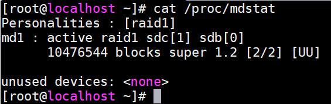
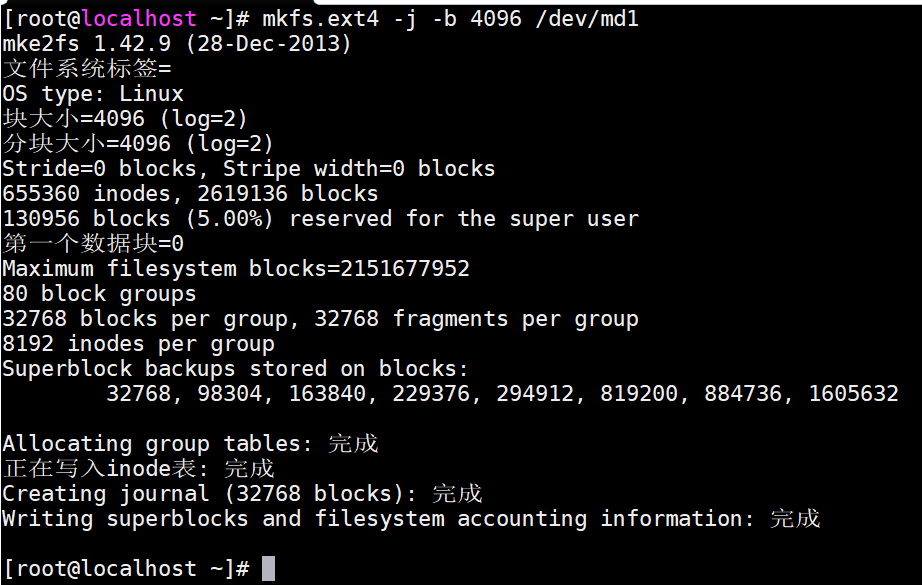

## RAID 1

> 原理

把一个磁盘的数据镜像到另一个磁盘上


> 磁盘数量

偶数块（保证副本集非0）

> 冗余能力

具有冗余能力

> 磁盘利用率

50%

> 适用场景

保存关键性的重要数据：系统盘

### 实现raid1

> 1.虚拟机添加两块硬盘


> 2.安装`raid`管理工具`mdadm`

```shell
yum install -y mdadm
```

> 3.查看磁盘情况

```shell
fdisk -l
```


> 4.创建`raid1`

**-n表示副本集**

```shell
mdadm -C /dev/md1 -n 2 -l 1 -a yes /dev/sd{b,c}
```


> 5.查看`raid`信息

```shell
cat /proc/mdstat
```



> 6.格式化

```shell
mkfs.ext4 -j -b 4096 /dev/md1
```



> 7.挂载

```shell
mkdir /mnt1
mount /dev/md1 /mnt1
echo "/dev/md1 /mnt1                       ext4     defaults        0 0" >> /etc/fstab
```


> 8.写数据

```shell
mkdir /mnt1/abc && touch /mnt1/abc/123
```

> 9.模拟损坏其中一个磁盘块

```shell
mdadm /dev/md1 -f /dev/sdc
```

> 10.查看`raid`信息


> 11.新增磁盘设备，添加到`md1`

```shell
mdadm /dev/md1 -a /dev/sdd
```

> 12.查看`raid`信息


> 13.删除已损坏的硬盘

```shell
mdadm /dev/md1 -r /dev/sdc
```

> 14.关闭raid

```shell
mdadm -S /dev/md1
```
