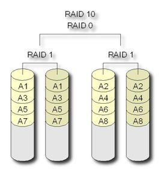

## raid10

`Raid 10`是一个`Raid 1`与`Raid0`的组合体，它是利用奇偶校验实现条带集镜像，
所以它继承了`Raid0`的快速和`Raid1`的安全。
我们知道，`RAID 1`在这里就是一个冗余的备份阵列，而`RAID 0`则负责数据的读写阵列。
其实，下图只是一种`RAID 10`方式，更多的情况是从主通路分出两路，做`Striping`操作，即把数据分割，
而这分出来的每一路则再分两路，做`Mirroring`操作，即互做镜像

> 磁盘数量

至少4个硬盘

> 冗余能力

具有冗余能力

> 磁盘利用率

50%

> 适用场景

保存关键性的重要数据

> 注意一下`Raid 10`和`Raid 01`的区别

`RAID01`又称为`RAID0+1`，先进行条带存放（`RAID0`），再进行镜像（`RAID1`）。

`RAID10`又称为`RAID1+0`，先进行镜像（`RAID1`），再进行条带存放（`RAID0`）。