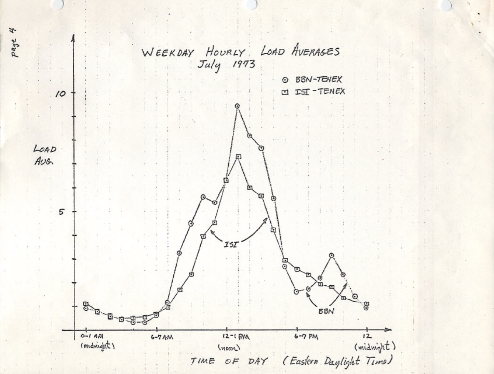
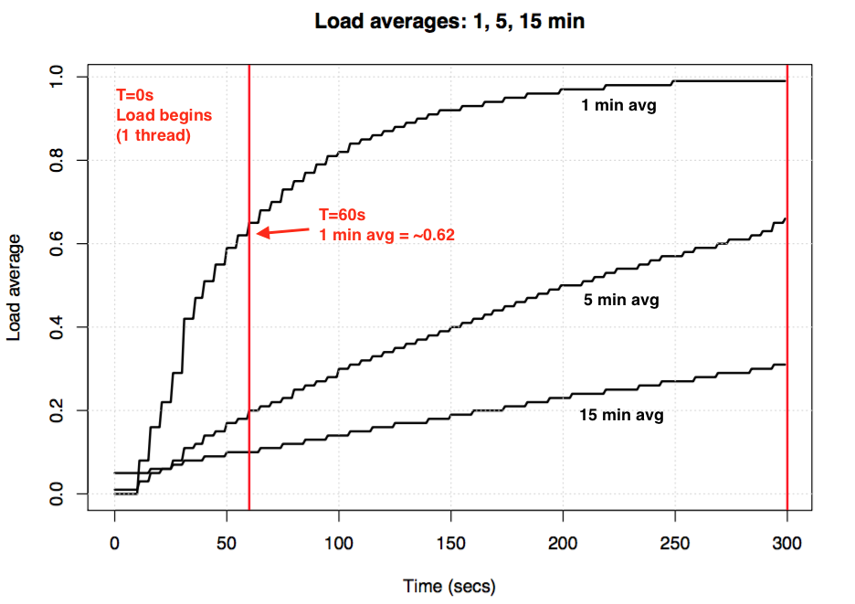

# linux性能分析之系统平均负载

## 你真的了解系统平均负载吗？

[Brendan Gregg's Blog](https://www.brendangregg.com/blog/index.html)

通常我们利用`uptime`或`top`分析系统平均负载情况，那如何通过该值分析系统繁忙程度？

`Linux`的平均负载不仅追踪可运行的任务，还追踪处于不可中断睡眠状态的任务。

`Linux`平均负载是"系统平均负载"，它显示系统上运行的线程(任务)需求，即运行线程的平均数量加上等待线程。（非CPU平均负载）

大多数工具显示了平均负载三个平均值，分别为1分钟、5分钟和15分钟:

```shell
$ uptime
 16:48:24 up  4:11,  1 user,  load average: 25.25, 23.40, 23.46

top - 16:48:42 up  4:12,  1 user,  load average: 25.25, 23.14, 23.37

$ cat /proc/loadavg 
25.72 23.19 23.35 42/3411 43603
```

关于平均负载数值的一些解释:

- 如果平均值是0.0，说明系统处于空闲状态
- 如果1分钟的平均值高于5或15分钟的平均值，那么负载处于降低状态
- 如果1分钟的平均值低于5或15分钟的平均值，那么负载处于升高状态
- 当平均值高于系统的CPU计数，那么系统可能会遇到性能问题

通过上面的解释，我们了解到：通过系统1分钟、5分钟和15分钟的平均负载值，可以分析出系统繁忙程度及趋势。
将平均负载值与系统CPU核数相比较，可以判断出系统是否存在性能问题。

## 历史回溯

起初平均负载只显示`CPU`需求: 运行的进程数加上等待运行的进程数。
在1973年8月[RFC 546](https://tools.ietf.org/html/rfc546) 的《TENEX平均负载》中有一个很好的描述:

> TENEX平均负载是衡量CPU需求的一个指标。平均负载是给定时间段内可运行进程数量的平均值。
> 例如，每小时平均负载为10意味着(对于单个CPU系统)在这一小时内的任何时候，都可能看到1个进程在运行，另外9个进程准备运行(即，没有阻塞I/O)等待CPU。

下面是一张1973年7月手工绘制的`TENEX`平均负载图表的`PDF`扫描



旧操作系统的源代码也可以在网上找到。下面内容是[TENEX](https://github.com/PDP-10/tenex)(20世纪70年代早期)`SCHED.DEC`宏汇编的摘要:

```shell
NRJAVS==3               ;NUMBER OF LOAD AVERAGES WE MAINTAIN
GS RJAV,NRJAVS          ;EXPONENTIAL AVERAGES OF NUMBER OF ACTIVE PROCESSES
[...]
;UPDATE RUNNABLE JOB AVERAGES

DORJAV: MOVEI 2,^D5000
        MOVEM 2,RJATIM          ;SET TIME OF NEXT UPDATE
        MOVE 4,RJTSUM           ;CURRENT INTEGRAL OF NBPROC+NGPROC
        SUBM 4,RJAVS1           ;DIFFERENCE FROM LAST UPDATE
        EXCH 4,RJAVS1
        FSC 4,233               ;FLOAT IT
        FDVR 4,[5000.0]         ;AVERAGE OVER LAST 5000 MS
[...]
;TABLE OF EXP(-T/C) FOR T = 5 SEC.

EXPFF:  EXP 0.920043902 ;C = 1 MIN
        EXP 0.983471344 ;C = 5 MIN
        EXP 0.994459811 ;C = 15 MIN
```

下面内容摘自现代Linux(include/linux/sched/loadavg.h):

```shell
#define EXP_1           1884            /* 1/exp(5sec/1min) as fixed-point */
#define EXP_5           2014            /* 1/exp(5sec/5min) */
#define EXP_15          2037            /* 1/exp(5sec/15min) */
```

Linux依旧硬编码了平均负载1分钟、5分钟和15分钟常量。

在旧系统中也有类似的平均负载指标，包括[Multics](http://web.mit.edu/Saltzer/www/publications/instrumentation.html)，它具有指数级调度队列平均值。

### 平均负载的三个数字

这三个数字分别是系统过去1、5和15分钟的平均负载。但它们并不是平均值，也不是1分钟、5分钟或15分钟。
从上面的资料中可以看出，1、5和15分钟是函数中使用的常数，用于计算5秒平均值的指数阻尼移动。
得到的1、5和15分钟的平均负载实际远远超过1、5和15分钟的负载。

如果您使用一个空闲的系统，然后开启一个单线程cpu绑定的工作负载(循环中有一个线程)， 那么60秒后一分钟的平均负载是多少?
如果它是一个普通的平均值，它应该是1.0。

下面为实验的图表:



所谓的"一分钟平均值"在一分钟的时候只能达到0.62左右。

关于这个等式和类似实验的更多信息，Neil Gunther博士写了一篇关于平均负载的文章:[How It Works](http://www.teamquest.com/import/pdfs/whitepaper/ldavg1.pdf)，
另外在[loadavg.c](https://github.com/torvalds/linux/blob/master/kernel/sched/loadavg.c)中有许多Linux源代码块注释。

### Linux TASK_UNINTERRUPTIBLE

当平均负载第一次出现在Linux中时，与其他操作系统一样它们反映了系统对`CPU`实际需求。

随着Linux的发展，平均负载不仅包括可运行的任务，还包括不可中断状态的任务(TASK_UNINTERRUPTIBLE或nr_uninterruptible)。

不可中断状态由代码路径使用，以避免信号的中断，其中包括在磁盘I/O和一些锁上阻塞的任务。
您以前可能见过这种状态: 它在输出`ps`和`top`中显示为`D`状态。ps(1)手册页称其为`不间断睡眠(通常为IO)`。

添加不可中断状态意味着`Linux`平均负载可能会由于磁盘(或NFS) `I/O`工作负载而增加，而不仅仅是`CPU`需求。
对于熟悉其他操作系统及其平均`CPU`负载的人来说，添加这种状态一开始会让人感到非常困惑。

那么`Linux`为什么要这么做呢？

很多关于平均负载的文章都指出了`Linux nr_uninterruptible`问题，
但却没有任何文章中解释或猜测为什么`Linux nr_uninterruptible`会被包括在内。

或许系统平均负载反映更广泛意义上的需求，而不仅仅是CPU需求。

## “不可中断”的起源

下面为[oldlinux.org](http://oldlinux.org/Linux.old/mail-archive/)上的一个1993年的压缩邮件文件内容，
邮件中阐述了系统平均负载应该包含不可中断任务的必要性：

```
From: Matthias Urlichs <urlichs@smurf.sub.org>
Subject: Load average broken ?
Date: Fri, 29 Oct 1993 11:37:23 +0200


The kernel only counts "runnable" processes when computing the load average.
I don't like that; the problem is that processes which are swapping or
waiting on "fast", i.e. noninterruptible, I/O, also consume resources.

It seems somewhat nonintuitive that the load average goes down when you
replace your fast swap disk with a slow swap disk...

Anyway, the following patch seems to make the load average much more
consistent WRT the subjective speed of the system. And, most important, the
load is still zero when nobody is doing anything. ;-)

--- kernel/sched.c.orig Fri Oct 29 10:31:11 1993
+++ kernel/sched.c  Fri Oct 29 10:32:51 1993
@@ -414,7 +414,9 @@
    unsigned long nr = 0;

    for(p = &LAST_TASK; p > &FIRST_TASK; --p)
-       if (*p && (*p)->state == TASK_RUNNING)
+       if (*p && ((*p)->state == TASK_RUNNING) ||
+                  (*p)->state == TASK_UNINTERRUPTIBLE) ||
+                  (*p)->state == TASK_SWAPPING))
            nr += FIXED_1;
    return nr;
 }
--
Matthias Urlichs        \ XLink-POP N|rnberg   | EMail: urlichs@smurf.sub.org
Schleiermacherstra_e 12  \  Unix+Linux+Mac     | Phone: ...please use email.
90491 N|rnberg (Germany)  \   Consulting+Networking+Programming+etc'ing      42
```

这证实了平均负载是故意更改的，以反映对其他系统资源的需求，而不仅仅是`cpu`。Linux从"平均CPU负载"变成了"平均系统负载"。

邮件提及的使用较慢交换磁盘的例子是有意义的: 随着系统性能的降低，系统的负载需求(以运行+排队的方式测量)应该会增加。
但是，平均负载下降了，因为它们只跟踪`CPU`运行状态，而不跟踪交换状态。马提亚斯认为这是不直观的，事实也是如此，所以他修正了它。

## 现如今的“不可中断”

但是Linux的平均负载有时不是太高了吗，超过了磁盘I/O所能解释的范围?

是的，在`Linux 0.99.14`中，有13个代码路径直接设置`TASK_UNINTERRUPTIBLE`或`TASK_SWAPPING`(交换状态后来从Linux中删除)。
现在，在`Linux 4.12`中，有将近400个代码路径设置`TASK_UNINTERRUPTIBLE`，包括一些锁原语。

原文作者给上文提到的马提亚斯发了邮件，问他如何看待20多年后平均负载的变化。马提亚斯回复道:

> `平均负载`的意义是从人的角度得出一个与系统繁忙程度相关的数字。
`TASK_UNINTERRUPTIBLE`意味着(或曾经意味着?)进程正在等待类似磁盘读取的操作，这会增加系统负载。
大量使用磁盘的系统可能非常缓慢，但`TASK_RUNNING`的平均值只有0.1，这对任何人都没有帮助

所以马提亚斯仍然认为它是有意义的，至少考虑到`TASK_UNINTERRUPTIBLE`过去的含义。

## 不间断测量任务

下面是一个生产机的`Off-CPU`火焰图，跨度为60秒，只显示内核堆栈，过滤后只包括处于`TASK_UNINTERRUPTIBLE`状态(即下图内容)的内核堆栈。
它提供了许多不可中断代码路径的例子:


如果您之前不了解`off-CPU`火焰图:

您可以单击帧来放大，查看显示为一个帧塔的完整堆栈。x轴大小与off-CPU阻塞所花费的时间成正比，排序顺序(从左到右)没有实际意义。
非cpu栈的颜色是蓝色(我对cpu栈使用暖色)，饱和度有随机方差来区分帧。

火焰图通过[bcc](https://github.com/iovisor/bcc) 生成（需要Linux 4.8+ 内核`eBPF`特性支持）

```shell
$ ./bcc/tools/offcputime.py -K --state 2 -f 60 > out.stacks
$ awk '{ print $1, $2 / 1000 }' out.stacks | ./FlameGraph/flamegraph.pl --color=io --countname=ms > out.offcpu.svgb>
```

从上面的火焰图可以看出: 60秒中只有926毫秒处于不可中断睡眠状态。这只会让我们的平均负载增加0.015。
在一些cgroup路径上是时间，但是这个服务器没有做太多的磁盘I/O。

下面是跨度为10秒的`Off-CPU`火焰图：


右边的宽塔在`proc_pid_cmdline_read()`(读取/proc/PID/cmdline)中显示`systemd-journal`，被阻塞，平均负载为0.07。
左侧还有一个更宽的页面错误塔，它也以`rwsem_down_read_failed()`结束(平均负载0.23)。

下面是`rwsem_down_read_failed()`的摘录:

```shell
/* wait to be given the lock */
while (true) {
    set_task_state(tsk, TASK_UNINTERRUPTIBLE);
    if (!waiter.task)
        break;
    schedule();
}
```
这是获取使用`TASK_UNINTERRUPTIBLE`锁代码。

Linux有不可中断和可中断版本的互斥锁获取函数(例如，`mutex_lock()` vs `mutex_lock_interruptible()`，以及用于信号量的`down()`和`down_interruptible()`)。
可中断版本允许任务被一个信号中断，然后在获得锁之前被唤醒处理它。不可中断锁睡眠中的时间通常不会对平均负载增加太多，但在本例中增加了0.30。
如果这个值较高就需要进行分析，分析如何减少锁争用(例如上面的：`systemd-journal`和`proc_pid_cmdline_read()`)，这将可能提高系统性能并降低平均负载。

将这些代码路径包含在平均负载中有意义吗? 我觉得是有意义的。

那些正在工作的线程碰巧阻塞在一个锁上。
Those threads are in the middle of doing work, and happen to block on a lock. They aren't idle. They are demand on the system, albeit for software resources rather than hardware resources.

## 分解Linux平均负载

能否将Linux负载平均值完全分解为组件? 下面是一个示例:

在一个空闲的`8核CPU`系统上，启动`tar`来归档一些未缓存的文件。该操作会花费几分钟的时间，主要是在读取磁盘时被阻塞。以下是来自三个不同终端窗口的统计数据:

- 窗口-`terma`

```shell
terma$ pidstat -p `pgrep -x tar` 60
Linux 4.9.0-rc5-virtual (bgregg-xenial-bpf-i-0b7296777a2585be1)     08/01/2017  _x86_64_    (8 CPU)

10:15:51 PM   UID       PID    %usr %system  %guest    %CPU   CPU  Command
10:16:51 PM     0     18468    2.85   29.77    0.00   32.62     3  tar
```

- 窗口-`termb`

```shell
termb$ iostat -x 60
[...]
avg-cpu:  %user   %nice %system %iowait  %steal   %idle
           0.54    0.00    4.03    8.24    0.09   87.10

Device:         rrqm/s   wrqm/s     r/s     w/s    rkB/s    wkB/s avgrq-sz avgqu-sz   await r_await w_await  svctm  %util
xvdap1            0.00     0.05   30.83    0.18   638.33     0.93    41.22     0.06    1.84    1.83    3.64   0.39   1.21
xvdb            958.18  1333.83 2045.30  499.38 60965.27 63721.67    98.00     3.97    1.56    0.31    6.67   0.24  60.47
xvdc            957.63  1333.78 2054.55  499.38 61018.87 63722.13    97.69     4.21    1.65    0.33    7.08   0.24  61.65
md0               0.00     0.00 4383.73 1991.63 121984.13 127443.80    78.25     0.00    0.00    0.00    0.00   0.00   0.00
```

- 窗口-`termc`

```shell
termc$ uptime
 22:15:50 up 154 days, 23:20,  5 users,  load average: 1.25, 1.19, 1.05
[...]
termc$ uptime
 22:17:14 up 154 days, 23:21,  5 users,  load average: 1.19, 1.17, 1.06
```

下图为`Off-CPU`火焰图


最后一分钟的平均负载是1.19。我们来分解一下:

- 0.33来自`tar`的`CPU`时间(`pidstat`)
- 0.67是来自`tar`的不可中断磁盘读取，推断(`offcpu`火焰图在`0.69`，我怀疑因为它开始收集有点晚，跨越的时间范围略有不同)
- 0.04是来自其他CPU消费者(iostat用户+系统，减去来自pidstat的tar的CPU)
- 0.11是来自内核worker的不间断磁盘I/O时间，刷新磁盘写(offcpu火焰图，左边的两个塔)

加起来是1.15，缺少0.04，其中一些可能是四舍五入和测量间隔偏移误差，但很多可能是由于负载平均值是指数阻尼移动，而我使用的其他平均值(pidstat, iostat)是正常平均值。
在1.19之前，一分钟平均水平是1.25，所以这部分仍将把我们拉高。 从我之前的图表中可以看出，在1分钟这一标记处，62%的指标来自这一分钟，其余的则更早。
所以0.62 x 1.15 + 0.38 x 1.25 = 1.18。这与报告中的1.19非常接近。

在这个系统中，一个用户线程(tar)加上一些系统线程(在内核工作线程中)处于工作状态，Linux的平均负载为1.19。
如果`Linux`平均负载测量的是`CPU平均负载`，上述值应为`0.37`(从mpstat的摘要中推断)而非`1.19`，
此时该值只能描述CPU计算资源需求，但是隐藏了一个事实，即该操作需要超过一个线程的系统资源。

## 理解Linux的平均负载

不同版本`Linux`系统的`平均负载`指代内容并不明确。也许问题根源来自`平均负载`这个词和`I/O`一样含糊不清。`I/O`指的到底是磁盘`I/O`? 还是文件系统`I/O`? 还是网络`I/O` ?

同样，平均负载指的是? CPU负载平均? 系统平均负载? 或许下面的总结更容易理解:

- 在`Linux`平台上，平均负载指的是`系统平均负载`，用于整个系统，
  度量正在工作和等待工作的线程数量(CPU、磁盘、不可中断锁)。换句话说，它度量非完全空闲的线程的数量。优点: 反应对不同系统资源的需求。
- 在其他操作系统上，平均负载指的是`CPU平均负载`，衡量的是CPU运行线程数 + CPU可运行线程数。优点:可以更容易理解和推理(仅针对cpu)。

## 如何评估系统平均负载的值？

有些人已经找到了适合他们的系统和工作负载的值:他们知道当负载超过X时，应用程序延迟就会很高，客户就会开始抱怨。当然，这个值并不唯一。

评估CPU平均负载时，可以将系统平均负载值除以CPU计数，然后如果该比率超过1.0，则表示CPU运行于饱和状态，这可能会导致性能问题。
这有点模棱两可，因为这是一个长期平均值(至少一分钟)，可能会隐藏变化。
一个比率为1.5的系统可能运行得很好，而另一个比率为1.5的系统在几分钟内突然爆发，可能运行得很糟糕。

评估Linux的系统平均负载时，由于涉及不同的资源类型，所以这些数据更加模糊，所以不能只除以CPU计数。
它对于相对以下场景比较更有用: 如果您知道系统在负载为20时运行良好，现在是40，那么就该排查下系统存在的问题了。

## 更好的负载指标

当Linux平均负载增加时，您知道对资源(cpu、磁盘和一些锁)的需求增加了，但不确定是哪一个。您可以使用其他指标进行说明。例如，对于cpu:

- 每个cpu利用率: 如使用`mpstat -P ALL 1`
- 每个进程的CPU利用率: 如`top, pidstat <pid>`等
- 每个线程运行队列(调度器)延迟: 例如，`cat /proc/<pid>/schedstats`, `delaystats`, `perf sched`
- CPU运行队列延迟: 例如，`cat /proc/schedstat`, `perf sched`
- CPU运行队列长度: 例如，使用`vmstat 1`和'r'列

前两个是利用率指标，后三个是饱和度指标。利用率度量对于工作负载表征很有用，饱和度量对于识别性能问题很有用。
最好的CPU饱和指标是度量运行队列(或调度器)延迟: 任务/线程处于可运行状态，但必须等待轮到CPU运行它的时间。
通过上述指标可以计算出性能问题的大小，例如，线程花费在调度器延迟上的时间百分比。

在`Linux 4.6`中，`schedstats`功能被设置为内核可调特性(`sysctl kernel.sched_schedstats`)，默认关闭。

```shell
$ awk 'NF > 7 { if ($1 == "task") { if (h == 0) { print; h=1 } } else { print } }' /proc/sched_debug
            task   PID         tree-key  switches  prio     wait-time             sum-exec        sum-sleep
         systemd     1      5028.684564    306666   120        43.133899     48840.448980   2106893.162610 0 0 /init.scope
     ksoftirqd/0     3 99071232057.573051   1109494   120         5.682347     21846.967164   2096704.183312 0 0 /
    kworker/0:0H     5 99062732253.878471         9   100         0.014976         0.037737         0.000000 0 0 /
     migration/0     9         0.000000   1995690     0         0.000000     25020.580993         0.000000 0 0 /
   lru-add-drain    10        28.548203         2   100         0.000000         0.002620         0.000000 0 0 /
      watchdog/0    11         0.000000   3368570     0         0.000000     23989.957382         0.000000 0 0 /
         cpuhp/0    12      1216.569504         6   120         0.000000         0.010958         0.000000 0 0 /
          xenbus    58  72026342.961752       343   120         0.000000         1.471102         0.000000 0 0 /
      khungtaskd    59 99071124375.968195    111514   120         0.048912      5708.875023   2054143.190593 0 0 /
[...]
         dockerd 16014    247832.821522   2020884   120        95.016057    131987.990617   2298828.078531 0 0 /system.slice/docker.service
         dockerd 16015    106611.777737   2961407   120         0.000000    160704.014444         0.000000 0 0 /system.slice/docker.service
         dockerd 16024       101.600644        16   120         0.000000         0.915798         0.000000 0 0 /system.slice/
[...]
```

除了CPU指标之外，您还可以查找磁盘设备的利用率和饱和度指标。

虽然有更明确的指标，但这并不意味着平均负载无用。它们被成功地用于云计算微服务的弹性扩展策略，以及其他指标。
这有助于微服务响应不同类型的负载增加，如CPU或磁盘I/O。

## 总结

1993年，一位Linux工程师发现了一个关于平均负载的不够直观的例子，并通过一个三行补丁将其从`平均CPU负载`永久地更改为人们可能称之为`平均系统负载`。
他的更改包括了处于不可中断状态的任务，这样平均负载就反映了对磁盘资源的需求，而不仅仅是`cpu`的需求。
这些系统负载平均值为正在工作和等待工作的线程数量，并总结为指数阻尼移动和平均值的三元组，在方程中使用1、5和15分钟作为常数。
这三个数字可以让您看到负载是增加还是减少，它们的最大值可能用于与它们本身的相对比较。

此后，不可中断状态的使用在Linux内核中得到了发展，现在包括了不可中断锁原语。
如果平均负载是运行和等待线程(严格来说不是需要硬件资源的线程)的需求度量，那么它们仍然按照我们希望的方式工作。

> 所谓原语，一般是指由若干条指令组成的程序段，用来实现某个特定功能，在执行过程中不可被中断。

在这篇文章中，原作者挖掘了1993年的Linux平均加载补丁——这是令人惊讶的难以找到的——包含了作者最初的解释。
并在现代Linux系统上使用`bcc/eBPF`测量了不可中断状态下的堆栈跟踪和时间，并可视化为`off-CPU`火焰图。
可视化提供了许多不可中断睡眠的例子，并且可以在需要解释异常高的平均负载时生成。并且他还提出了其他指标，可以用来更详细地了解系统负载，而不是平均负载。

## 参考文献

[linux-performance-analysis](https://github.com/bregman-arie/devops-exercises#linux-performance-analysis)
[Linux Load Averages: Solving the Mystery](https://www.brendangregg.com/blog/2017-08-08/linux-load-averages.html)