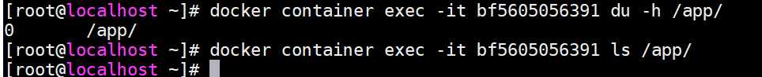

<!-- START doctoc generated TOC please keep comment here to allow auto update -->
<!-- DON'T EDIT THIS SECTION, INSTEAD RE-RUN doctoc TO UPDATE -->
**Table of Contents**  *generated with [DocToc](https://github.com/thlorenz/doctoc)*

- [volums](#volums)
  - [管理方式](#%E7%AE%A1%E7%90%86%E6%96%B9%E5%BC%8F)
  - [使用场景](#%E4%BD%BF%E7%94%A8%E5%9C%BA%E6%99%AF)
  - [管理volume](#%E7%AE%A1%E7%90%86volume)
- [Bind mounts](#bind-mounts)
- [volums与Bind mounts对比](#volums%E4%B8%8Ebind-mounts%E5%AF%B9%E6%AF%94)
- [关于volums与Bind mounts使用说明](#%E5%85%B3%E4%BA%8Evolums%E4%B8%8Ebind-mounts%E4%BD%BF%E7%94%A8%E8%AF%B4%E6%98%8E)
- [tmpfs](#tmpfs)
- [存储驱动](#%E5%AD%98%E5%82%A8%E9%A9%B1%E5%8A%A8)
  - [可写入层](#%E5%8F%AF%E5%86%99%E5%85%A5%E5%B1%82)
  - [写时拷贝](#%E5%86%99%E6%97%B6%E6%8B%B7%E8%B4%9D)
- [overlay2](#overlay2)

<!-- END doctoc generated TOC please keep comment here to allow auto update -->

**几种数据持久方案区别**

volume：对宿主机文件系统之上的 容器可写入层 进行读写操作

Bind mounts：宿主机与容器以映射的方式共享目录，对宿主机文件系统进行读写操作

tmpfs：数据存储于内存中，不持久化

## volums ##

Volumes方式的数据存储于docker宿主机的/var/lib/docker/volumes/下（Linux系统下），由于linux严格的权限管理，非docker进程无法修改该目录下数据，具有很好的隔离性，volums为目前最好的docker容器数据持久化的方式。

### 管理方式 ###

	由docker进行创建管理，创建方式为两种：

	1、手动创建
	docker volume create

	2、自动创建
	随容器/服务的创建而被创建

### 使用场景 ###

	1、多容器运行时共享数据

	2、当Docker主机不能保证具有给定的目录或文件结构时。卷可以帮助您将Docker主机的配置与容器运行时解耦。（例如A环境具有/data目录，当迁移至B环境不具有/data目录）

	3、存储容器数据于远程主机

	4、备份、迁移容器数据等至远程主机，备份目录
	/var/lib/docker/volumes/<volume-name>

### 管理volume ###

	#1、手动创建
	docker volume create my-volume
	
	#查看volume
	docker inspect my-volume

	#2、创建启动容器时指定volume
	docker run -d --name test-nginx --mount source=myvol2,target=/app nginx:latest

	#查看volume列表(默认在创建启动容器时自动创建了myvol2)
	docker volume ls

	#接下来，测试删除容器后volume是否会随之被删除(很显然删除容器对volume并未产生影响，需手动删除)

	#手动删除volume

volume指定为只读方式

	#创建启动容器，指定volumew名为nginx-vol（实际路径为/var/lib/docker/volumes/nginx-vol），对应容器内/usr/share/nginx/html目录，并且为只读状态（容器内禁止写操作）
	docker run -d --name=nginxtest --mount source=nginx-vol,destination=/usr/share/nginx/html,readonly nginx:latest

	#查看本地volume情况(nginx容器内的数据已挂载出来)

	#访问容器内，验证可读属性（）
	docker container exec -it nginxtest bash
	cd /usr/share/nginx/html
	echo 1 >> 50x.html

## Bind mounts ##

Bind mounts方式理论上可以在宿主机任意位置持久化数据，显然非docker进程可以修改这部分数据，隔离性较差。

> 使用场景

	1、容器与宿主机共享配置文件等（如dns、时区等）

	2、共享源代码或打包后的应用程序（例如：宿主机maven打包java程序，只需挂载target/目录，容器内即可访问到打包好的应用程序）
	当然，该方式仅适用于开发环境，安全考虑并不推荐使用于生产环境

	3、Docker主机的文件或目录结构与容器所需的绑定挂载一致时。（例如容器内读取配置文件目录为/etc/redis.conf,而宿主机/etc/redis.conf并不存在，则需要匹配路径进行挂载）

## volums与Bind mounts对比 ##

1. Volumes方式更容易备份、迁移

2. Volumes可以通过docker命令行指令或api进行管理

3. Volumes适用于windows与linux环境

4. Volumes多容器分享数据更安全（非docker进程无法修改该部分数据）

5. Volume drivers可以实现加密传输数据持久化至远程主机。

6. 新volume的内容可以由容器预先填充

## 关于volums与Bind mounts使用说明 ##

1. 如果你挂载一个空的volums到容器的/data目录，并且容器内/data下数据非空，则容器内的/data数据会拷贝到新挂载的卷上；相似的，如果你挂载了宿主机不存在的volums至容器内部，这个不存在的目录则会自动创建

2. 如果你使用bind mount或挂载一个非空的volum到容器的/data目录，并且容器内/data下数据非空，则容器内的/data部分数据会被覆盖（相同目录/文件名）

## tmpfs ##

tmpfs方式数据存储宿主机系统内存中，并且不会持久化到宿主机的文件系统中（磁盘）

> 使用场景

	存储敏感数据（swarm利用tmpfs存放secrets于内存中）

> 数据共享

与`volume`、`bind mounts`方式不同，`tmpfs`无法跨容器共享数据，即仅适用于单机模式。

> 环境依赖说明

`tmpfs`仅支持Linux环境下docker使用

> 使用方式

	#nginx容器内/app下的数据将写入至宿主机内存之中。

	#1、方式一
	docker run -d \
	  -it \
	  --name tmptest \
	  --mount type=tmpfs,destination=/app \
	  nginx:latest

	#2、方式二
	docker run -d \
	  -it \
	  --name tmptest \
	  --tmpfs /app \
	  nginx:latest

> 验证数据是否存储于内存中

	#1、分配虚拟机8G内存

	#2、启动nginx容器，指定--tmpfs方式存储数据
	

	#3、查看内存占用
	docker ps

	#bf5605056391为容器ID
	ps -ef|grep bf5605056391

	#11298为容器进程PID
	top -p 11298

	#4、拷贝918M大小文件至容器/app下 ，观察内存变化
	docker cp CentOS-7-x86_64-Minimal-1810.iso bf5605056391:/app/

	#5、查看内存占用
	free -h

	#6、多次拷贝观察宿主机内存变化（文件名注意修改，避免被覆盖）
	docker cp CentOS-7-x86_64-Minimal-1810.iso bf5605056391:/app/CentOS-7-x86_64-Minimal-1810.iso2
	docker cp CentOS-7-x86_64-Minimal-1810.iso bf5605056391:/app/CentOS-7-x86_64-Minimal-1810.iso2
	docker cp CentOS-7-x86_64-Minimal-1810.iso bf5605056391:/app/CentOS-7-x86_64-Minimal-1810.iso4

	#7、内存变化（大约900M左右的递减，与文件大小相匹配）

	#8、让我们看下容器内部/app下存储了什么(nothing,说明容器内写入/app的数据都被写入到了内存里，/app下也并不会持久化)
	

	#9、如果我们通过不断向容器内/app下写入数据会怎样？(竟然没有出现crash相关情况发生，初步猜测最开始存放的数据被回收释放)

	#10、测试删除容器，内存是否会被释放
	docker container rm -f bf5605056391

> 验证tmpfs存储大小限制

	#1、启动nginx容器，1073741824为字节数（等于1GB）

**换算地址**
[http://www.elecfans.com/tools/zijiehuansuan.html](http://www.elecfans.com/tools/zijiehuansuan.html)

**官方配置说明**

	docker run -d \
	  -it \
	  --name tmptest \
	  --mount type=tmpfs,destination=/app,tmpfs-size=1073741824 \
	  nginx:latest

	#2、不断拷贝数据到容器内部，观察内存大小

竟然没有生效，难道是配置错了？

	#3、删除容器，重启配置(官方提供信息指出默认单位是字节，可实际看来怎么是MB，难道理解有误？)
	docker run -d \
	  -it \
	  --name tmptest \
	  --mount type=tmpfs,destination=/app,tmpfs-size=1024 \
	  nginx:latest

	#4、删除容器，重启配置(1GB大小限制未生效，难道单位问题？)
	docker run -d \
	  -it \
	  --name tmptest \
	  --mount type=tmpfs,destination=/app,tmpfs-size=1GB \
	  nginx:latest

	#5、删除容器，重启配置(1G大小限制未生效)
	docker run -d \
	  -it \
	  --name tmptest \
	  --mount type=tmpfs,destination=/app,tmpfs-size=1G \
	  nginx:latest

	#6、删除容器，重启配置，限制大小10M(？？？竟然也未生效？，难道第三步测试有误)
	docker run -d \
	  -it \
	  --name tmptest \
	  --mount type=tmpfs,destination=/app,tmpfs-size=10 \
	  nginx:latest

**仔细观察第三步测试，拷贝到容器内的文件名一样，果然测试有误**

	#7、看来这个配置项并未生效

## 存储驱动 ##

**以下内容基于**`overlay2`

`overlay2`为docker存储驱动的一种，负责容器读写（不会修改镜像原始数据）镜像数据

### 可写入层 ###

`writable layer`

官方文档描述如下：

	When you start a container, a thin writable container layer is added on top of the other layers. 
	Any changes the container makes to the filesystem are stored here. 
	Any files the container does not change do not get copied to this writable layer. 
	This means that the writable layer is as small as possible.

假设现在有镜像A，B构建文件如下

	#A镜像构建文件（构建镜像名为：imageA，拷贝内容为hello.sh、app.py）
	FROM ubuntu:18.04
	COPY ./hello.py ./hello.sh /app/
	CMD python /app/app.py

	#B镜像构建文件（构建镜像名为：imageB）
	FROM imageB
	CMD /bin/bash /app/hello.sh

	#hello.sh内容
	#!/bin/sh
	echo "Hello world"

	#hello.py内容
	print('hello python!')

目录结构及文件内容如下

构建镜像ab

	docker build -t imagea -f Dockerfile.A .
	docker build -t imageb -f Dockerfile.B .

查看两者层级

	
很显然，A镜像红框内的3个层级分别由以下构建命令生成，其他层级由基础镜像ubuntu:18.04生成

	FROM ubuntu:18.04
	COPY ./hello.py ./hello.sh /app/
	CMD python /app/app.py

而B镜像对比A镜像之多出一个层级313438ff3ff4，即以下构建指令生成的层，该层即为可写入层，镜像B与镜像A的区别存储于该层
而镜像B与镜像A相同的层级指向同一系统存储地址，
由于该层仅为一条shell指令故大小可以忽略不计，即构建B镜像理论上对宿主机磁盘的占用忽略不计，由此可看见docker的分层结构相当节省存储空间

`Any changes the container makes to the filesystem are stored here`

	CMD /bin/bash /app/hello.sh

**测试以上结论是否正确**

构建镜像CD，配置文件内容为如下：

	#Dockerfile.C
	FROM imageb
	COPY CentOS-7-x86_64-Minimal-1804.iso /

	#Dockerfile.D
	FROM imagec
	CMD /bin/bash /app/hello.py

**此时磁盘空间大小**

文件大小为906M，理论上构建CD镜像后，磁盘剩余空间在14031-906=13125M左右

	docker build -t imagec -f Dockerfile.C .
	docker build -t imaged -f Dockerfile.D .

很显然测试结果验证了以上的结论（当然官方已经说明了，这里仅仅是测试而已），我们再看下镜像cd的层级

**测试删除镜像C，对磁盘空间有何影响**

分析：由于镜像C与镜像D有相同分层，且镜像D比镜像C多一个层级，即可以理解为D内数据包含C数据，删除镜像C对宿主机磁盘空间无任何影响

由此可见，验证了我们的猜测：删除镜像C对宿主机磁盘空间无任何影响（存在镜像D包含镜像C所有数据内容）

**测试生成镜像E，构建内容为镜像C的内容，宿主机磁盘空间是否变化。**

分析：因为E的所有数据内容都已存在（镜像D持有），故磁盘空间不会发生变化

	#Dockerfile.E
	FROM imageb
	COPY CentOS-7-x86_64-Minimal-1804.iso /

	docker build -t imagee -f Dockerfile.E .

显然猜测成立

**测试删除镜像D、E，对磁盘空间有何影响**

分析：由于镜像C、镜像D、镜像E均持有`COPY CentOS-7-x86_64-Minimal-1804.iso /`层级，镜像C已经删除，此时再删除镜像D、镜像E，
`COPY CentOS-7-x86_64-Minimal-1804.iso /`层级无其他镜像引用，导致磁盘空间释放906M

猜测成立！

**结论如下：**

- docker分层架构在很大程度上节省了磁盘存储开销（镜像文件一般较大），相同层级只存储一份

- 删除镜像时，只会删除与其他镜像`非同层级数据`

`copy-on-write`

### 写时拷贝 ###

官方对Copy-on-write的说明:

	Copy-on-write is a strategy of sharing and copying files for maximum efficiency. If a file or directory exists in a lower layer within the image, and another layer (including the writable layer) needs read access to it, it just uses the existing file. The first time another layer needs to modify the file (when building the image or running the container), the file is copied into that layer and modified. This minimizes I/O and the size of each of the subsequent layers. These advantages are explained in more depth below

	总结为：容器需要读写底层（镜像的层级）数据时，会将文件或目录拷贝到容器`可写层`进行读写，而非全部拷贝（显然镜像的某些层级包含的文件在容器整个运行周期中可能并不会用到）。

**测试写时拷贝**

	#构建镜像F
	#Dockerfile.F
	FROM centos
	COPY CentOS-7-x86_64-Minimal-1804.iso /

	docker build -t imagef -f Dockerfile.F .

分析：运行时并未读写其他层级数据，容器大小忽略不计

	

官方对Copy-on-write优势的说明:

	Not only does copy-on-write save space, but it also reduces start-up time.
	When you start a container (or multiple containers from the same image), Docker only needs to create the thin writable container layer

	总结：节省存储空间、容器启动快

## overlay2 ##

`overlay2`可理解为连接`container (upperdir)`与`image (lowerdir)`的纽带，类比显卡驱动等

> 容器读取文件

官方列举三个场景

	The file does not exist in the container layer: 
	If a container opens a file for read access and the file does not already exist in the container (upperdir) it is read from the image (lowerdir). 
	This incurs very little performance overhead.

	#如果容器层不存在该文件，将从镜像层读取，官方表示性能损耗较小。

	The file only exists in the container layer:
	If a container opens a file for read access and the file exists in the container (upperdir) and not in the image (lowerdir), 
	it is read directly from the container.

	#如果容器层存在该文件，将直接从容器层读取
	
	The file exists in both the container layer and the image layer: 
	If a container opens a file for read access and the file exists in the image layer and the container layer, 
	the file’s version in the container layer is read. 
	Files in the container layer (upperdir) obscure files with the same name in the image layer (lowerdir).

	#如果容器层、镜像层均存在该文件，优先读取容器层文件的版本

> 容器修改文件|目录

官方列举几个场景：

	Writing to a file for the first time: 
	The first time a container writes to an existing file, that file does not exist in the container (upperdir). 
	The overlay/overlay2 driver performs a copy_up operation to copy the file from the image (lowerdir) to the container (upperdir). 
	The container then writes the changes to the new copy of the file in the container layer.

	#第一次修改容器层不存在的文件时，overlay驱动执行`copy_up`操作，将文件从镜像层拷贝到容器层，然后容器将"更改"写入容器层中文件的新副本

	However, OverlayFS works at the file level rather than the block level. 
	This means that all OverlayFS copy_up operations copy the entire file, even if the file is very large and only a small part of it is being modified. This can have a noticeable impact on container write performance. However, two things are worth noting:

	1、The copy_up operation only occurs the first time a given file is written to. 
	Subsequent writes to the same file operate against the copy of the file already copied up to the container.

	2、OverlayFS only works with two layers.
	This means that performance should be better than AUFS, which can suffer noticeable latencies when searching for files in images with many layers.
    This advantage applies to both overlay and overlay2 drivers. overlayfs2 is slightly less performant than overlayfs on initial read, 
	because it must look through more layers, but it caches the results so this is only a small penalty.

	#只有第一次文件拷贝为全量拷贝，以后读写操作均操作容器层上的文件副本

	Deleting files and directories:

	1、When a file is deleted within a container, a whiteout file is created in the container (upperdir). 
	The version of the file in the image layer (lowerdir) is not deleted (because the lowerdir is read-only).
    However, the whiteout file prevents it from being available to the container.

	2、When a directory is deleted within a container, an opaque directory is created within the container (upperdir). 
    This works in the same way as a whiteout file and effectively prevents the directory from being accessed, 
    even though it still exists in the image (lowerdir).

	#当删除容器内的某一文件（假如/usr/bin/telnet）或目录（/boot）时，对应镜像层的文件不会被删除（只读性），虽然镜像层依然存在该文件，但容器层已服务对其进行读写

	Renaming directories: 
	Calling rename(2) for a directory is allowed only when both the source and the destination path are on the top layer. 
	Otherwise, it returns EXDEV error (“cross-device link not permitted”).
    Your application needs to be designed to handle EXDEV and fall back to a “copy and unlink” strategy.

	#重命名容器内目录：（不太理解）
	只有当源路径和目标路径都位于顶层时，才允许为目录调用rename(2)。
	否则，它将返回EXDEV错误(“不允许跨设备链接”)。您的应用程序需要设计成能够处理EXDEV并返回到“复制和断开链接”策略。