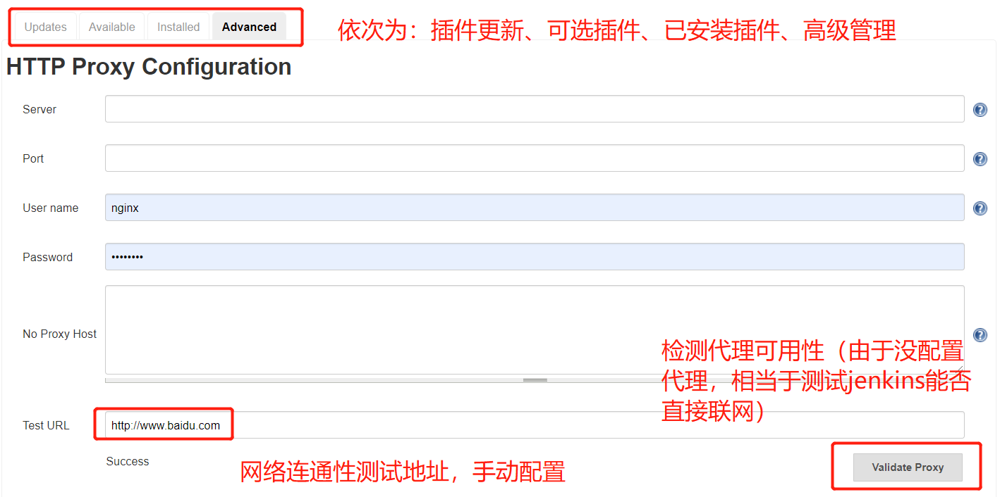
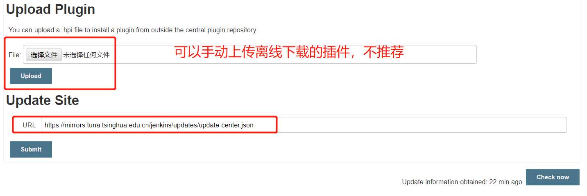

### 插件管理

浏览器访问`http://192.168.1.2:8081/jenkins/pluginManager/advanced`

> 按需配置代理



> 更改插件源为国内源

更改为清华源

```text
https://mirrors.tuna.tsinghua.edu.cn/jenkins/updates/update-center.json
```



**安装以下插件**

- `Credentials Binding`
