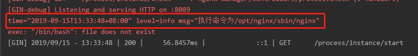
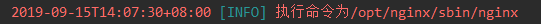

## 日志管理

[logrus项目地址](https://github.com/sirupsen/logrus)

> 1.添加或直接`import`(利用gomod自动下载)

```shell
go get github.com/sirupsen/logrus
```

> 2.默认输出格式

样例如下入参为 `/opt/nginx/sbin/nginx`

```go
package process

import (
    "bytes"
    log "github.com/sirupsen/logrus"
    "os/exec"
)

var(
    exitCode = 0
    out bytes.Buffer
)

func Shell(shell string) (stdout string,exitCode int){

    cmd := exec.Command("/bin/bash", "-c", shell + " 2>&1")
    log.Info("执行命令为" + shell)

    cmd.Stdout = &out
    if err := cmd.Start();err != nil {
        println(err.Error())
    }
    if err := cmd.Wait();err != nil {
        exitCode = 1
    }
    return out.String(),exitCode
}
```

输出如下



> 3.引入格式包

```shell
go get github.com/antonfisher/nested-logrus-formatter
```

> 4.格式化日志输出

```go
package utils

import (
nested "github.com/antonfisher/nested-logrus-formatter"
"github.com/sirupsen/logrus"
"time"
)


type Formatter struct {
    FieldsOrder     []string // by default fields are sorted alphabetically
    TimestampFormat string   // by default time.StampMilli = "Jan _2 15:04:05.000" is used
    HideKeys        bool     // to show only [fieldValue] instead of [fieldKey:fieldValue]
    NoColors        bool     // to disable all colors
    NoFieldsColors  bool     // to disable colors only on fields and keep levels colored
    ShowFullLevel   bool     // to show full level (e.g. [WARNING] instead of [WARN])
    TrimMessages    bool     // to trim whitespace on messages
}
    
    func Logger(format string, args ...interface{})  {
    logrus.SetFormatter(&logrus.TextFormatter{ForceColors: true})
    logrus.SetLevel(logrus.InfoLevel)
    logrus.SetFormatter(&nested.Formatter{
        HideKeys:    true,
        NoColors:    false,
        TrimMessages:false,
        TimestampFormat: time.RFC3339,
        FieldsOrder: []string{"component", "category"},
    })
}
```

输出信息如下

