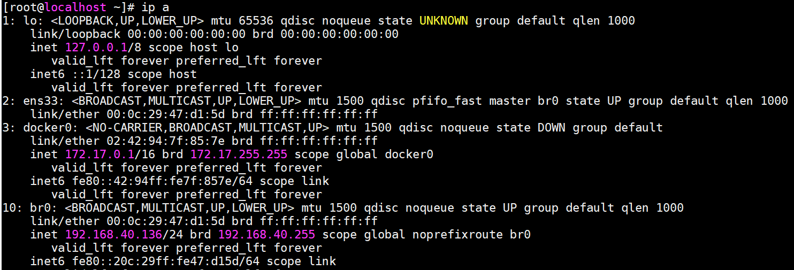

<!-- START doctoc generated TOC please keep comment here to allow auto update -->
<!-- DON'T EDIT THIS SECTION, INSTEAD RE-RUN doctoc TO UPDATE -->
**Table of Contents**  *generated with [DocToc](https://github.com/thlorenz/doctoc)*

- [complete network communication between two containers via veth-paris & network namespaces.](#complete-network-communication-between-two-containers-via-veth-paris--network-namespaces)

<!-- END doctoc generated TOC please keep comment here to allow auto update -->

## complete network communication between two containers via veth-paris & network namespaces.

> 1、安装pipework

	yum install git bridge-utils -y
	git clone https://github.com/jpetazzo/pipework
	cd pipework
	cp pipework /usr/bin/

> 2、配置pipework

修改物理网卡配置

**修改前：**

	TYPE=Ethernet
	PROXY_METHOD=none
	BROWSER_ONLY=no
	BOOTPROTO=static
	DEFROUTE=yes
	IPV4_FAILURE_FATAL=no
	IPV6INIT=yes
	IPV6_AUTOCONF=yes
	IPV6_DEFROUTE=yes
	IPV6_FAILURE_FATAL=no
	IPV6_ADDR_GEN_MODE=stable-privacy
	NAME=ens33
	UUID=5b8e5f27-6e21-4a48-97eb-05cca1056a98
	DEVICE=ens33
	IPADDR=192.168.40.136
	NETMASK=255.255.255.0
	GATEWAY=192.168.40.2
	PREFIX=24
	ONBOOT=yes
	ZONE=

**修改后：**

	TYPE=Ethernet
	PROXY_METHOD=none
	BROWSER_ONLY=no
	BOOTPROTO=none
	DEFROUTE=yes
	IPV4_FAILURE_FATAL=no
	IPV6INIT=yes
	IPV6_AUTOCONF=yes
	IPV6_DEFROUTE=yes
	IPV6_FAILURE_FATAL=no
	IPV6_ADDR_GEN_MODE=stable-privacy
	NAME=ens33
	UUID=5b8e5f27-6e21-4a48-97eb-05cca1056a98
	DEVICE=ens33
	#IPADDR=192.168.40.136
	#NETMASK=255.255.255.0
	#GATEWAY=192.168.40.2
	#PREFIX=24
	ONBOOT=yes
	ZONE=
	BRIDGE=br0

创建网桥，宿主机IP为136（原物理网卡ens33 IP地址）

	cat >> /etc/sysconfig/network-scripts/ifcfg-br0 <<EOF
	TYPE=Bridge
	BOOTPROTO=static
	IPADDR=192.168.40.136
	NETMASK=255.255.255.0
	GATEWAY=192.168.40.2
	PREFIX=24
	NAME=br0
	ONBOOT=yes
	DEVICE=br0
	EOF

重启网络

	systemctl restart network

查看宿主机网络

	ip a

创建容器A，并配置独立IP 180

	docker run -itd --net=none --name testA busybox /bin/sh

	pipework br0 testA 192.168.40.180/24@192.168.40.2

创建容器B，并配置独立IP 190

	docker run -itd --net=none --name testB busybox /bin/sh

	pipework br0 testB 192.168.40.190/24@192.168.40.2

查看容器testA IP地址

	docker exec -it testA ip a

查看容器testB IP地址

	docker exec -it testB ip a

宿主机ping testA testB 网络

容器A、容器B测试网络连通性

	docker exec -it testA ping 192.168.40.190 -c 3
	docker exec -it testB ping 192.168.40.180 -c 3

11/18/2019 7:56:37 PM 
	

	