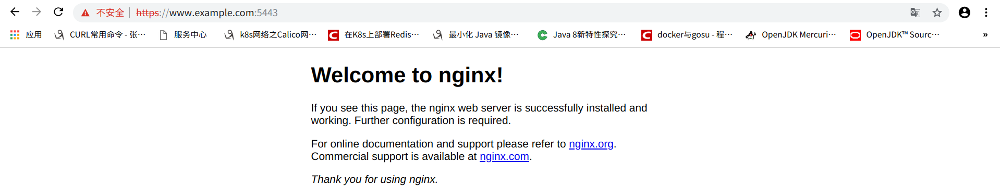

### 自签

[自签脚本](script/ssl-generate)

下载自签名证书生成脚本，修改以下内容

    # 域名
    export domain=www.example.com
    
    # IP地址（可选）
    export address=192.168.1.11
    
    # 国家
    export contryName=CN
    
    # 省/州/邦
    export stateName=Liaoning
    
    # 地方/城市名
    export locationName=Shenyang
    
    # 组织/公司名称
    export organizationName=example
    
    # 组织/公司部门名称
    export sectionName=develop
    
- [升级openssl版本](openssl.md)
    
- 生成字签证书
   
      sh ssl-generate
    
nginx配置

[参考地址](https://raymii.org/s/tutorials/Strong_SSL_Security_On_nginx.html)

    server {
        listen 5443 ssl;
        ssl_protocols TLSv1.2;
        ssl_ciphers ECDHE-RSA-AES256-GCM-SHA512:DHE-RSA-AES256-GCM-SHA512:ECDHE-RSA-AES256-GCM-SHA384:DHE-RSA-AES256-GCM-SHA384:ECDHE-RSA-AES256-SHA384;
        ssl_prefer_server_ciphers on;
        ssl_session_cache shared:SSL:10m;
        ssl_certificate /path/to/yourdomain.crt;
        ssl_certificate_key /path/to/yourdomain.key;
    ...其他Location配置...
    }
    

### 免费的ssl签发证书

### 基于IP地址签发的SSL证书

[DVSSL](https://www.sslzhengshu.com/validation/ip-ssl.html)