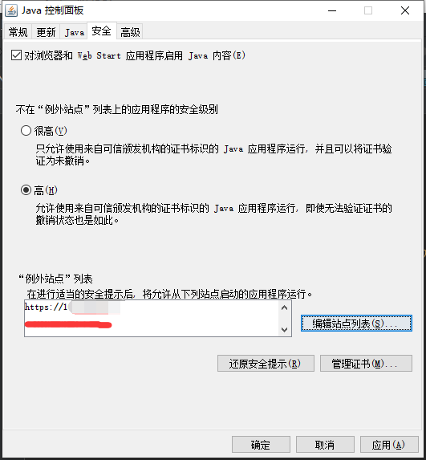

## 安装java

> 下载虚拟控制台连接文件

修改文件为：

    viewer.jnlp

> widows环境下下载安装java1.7

[jre1.7下载地址](https://download.oracle.com/otn/java/jdk/7u80-b15/jre-7u80-windows-x64.exe)

> 调整java安全级别

控制面板 -> 程序 -> java
    

安全 -> 编辑站点列表

添加 -> 输入iDRAC控制台IP地址 -> 确定

应用 -> 确定

> 运行jnlp文件

鼠标右键viewer.jnlp -> 打开方式 -> 选择jre1.7的javaws.exe文件

    