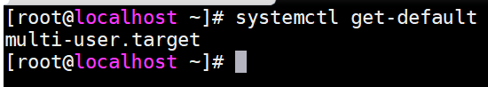

### oracle单机集成部署 ###

> 配置yum源

	采用aliyun源

### 安装条件检测 ###

**以下内容仅为官网要求部分摘抄，详细环境要求如下**

[https://docs.oracle.com/en/database/oracle/oracle-database/12.2/ladbi/oracle-database-installation-checklist.html#GUID-E847221C-1406-4B6D-8666-479DB6BDB046](https://docs.oracle.com/en/database/oracle/oracle-database/12.2/ladbi/oracle-database-installation-checklist.html#GUID-E847221C-1406-4B6D-8666-479DB6BDB046)

> 硬件要求

	1、DVD光驱（如果采用DVD光盘安装）

	2、linux系统运行级别为3或5

	3、显卡分辨率最低1024 x 768（Oracle Universal Installer图形化安装需要）

	4、oracle宿主机联网（拥有网络适配器）

	5、最小1g内存，建议2g

	#Linux系统有7个运行级别(runlevel)
	运行级别0：系统停机状态，系统默认运行级别不能设为0，否则不能正常启动
	运行级别1：单用户工作状态，root权限，用于系统维护，禁止远程登陆
	运行级别2：多用户状态(没有NFS)
	运行级别3：完全的多用户状态(有NFS)，登陆后进入控制台命令行模式
	运行级别4：系统未使用，保留
	运行级别5：X11控制台，登陆后进入图形GUI模式
	运行级别6：系统正常关闭并重启，默认运行级别不能设为6，否则不能正常启动

	#查看当前系统运行级别(即多用户级别)
	systemctl get-default  或 runlevel

	运行级别的原理：
	1。在目录/etc/rc.d/init.d下有许多服务器脚本程序，一般称为服务(service)
	2。在/etc/rc.d下有7个名为rcN.d的目录，对应系统的7个运行级别
	3。rcN.d目录下都是一些符号链接文件，这些链接文件都指向init.d目录下的service脚本文件，命名规则为K+nn+服务名或S+nn+服务名，其中nn为两位数字。
	4。系统会根据指定的运行级别进入对应的rcN.d目录，并按照文件名顺序检索目录下的链接文件
	     对于以K开头的文件，系统将终止对应的服务
	     对于以S开头的文件，系统将启动对应的服务
	5。查看运行级别用：runlevel
	6。进入其它运行级别用：init N
	7。另外init0为关机，init 6为重启系统

> 操作系统要求

	1、安装OpenSSH服务

	2、针对X86-64系统内核支持

	Oracle Linux 7 with the Unbreakable Enterprise Kernel 3: 3.8.13-35.3.1.el7uek.x86_64 or later
	Oracle Linux 7.2 with the Unbreakable Enterprise Kernel 4: 4.1.12-32.2.3.el7uek.x86_64 or later
	Oracle Linux 7 with the Red Hat Compatible kernel: 3.10.0-123.el7.x86_64  or later
	
	Red Hat Enterprise Linux 7: 3.10.0-123.el7.x86_64 or later
	Oracle Linux 6.4 with the Unbreakable Enterprise Kernel 2: 2.6.39-400.211.1.el6uek.x86_64or later
	Oracle Linux 6.6 with the Unbreakable Enterprise Kernel 3: 3.8.13-44.1.1.el6uek.x86_64 or later
	Oracle Linux 6.8 with the Unbreakable Enterprise Kernel 4: 4.1.12-37.6.2.el6uek.x86_64 or later
	Oracle Linux 6.4 with the Red Hat Compatible kernel: 2.6.32-358.el6.x86_64 or later
	Red Hat Enterprise Linux 6.4: 2.6.32-358.el6.x86_64 or later
	SUSE Linux Enterprise Server 12 SP1: 3.12.49-11.1 or later

	SUSE Linux Enterprise Server 15: 4.12.14-25-default or later
	
	Review the system requirements section for a list of minimum package requirements.

	3、若宿主机操作系统为Oracle Linux，建议使用oracle预编译rpm包进行oracle环境初始化

> 宿主机配置要求

	1、/tmp下只要1GB可用存储空间
	
	2、交换区内存大小应满足以下要求
	
	当物理内存在1GB与2GB之间，swap内存应为物理内存的1.5倍
	当物理内存在2GB与16GB之间，swap内存应等于物理内存
	当物理内存高于16GB，swap内存固定16G

	需要注意的是，如果为Linux服务器启用了HugePages，那么在计算交换空间之前，应该从可用RAM中减去分配给HugePages的内存

	3、oracle安装目录必须为ASCII字符

	4、清除以下变量（如果当前主机安装过oracle，会存在以下变量）
	$ORACLE_HOME,$ORA_NLS10, $TNS_ADMIN, $ORACLE_BASE, $ORACLE_SID 

	5、使用root用户或具有root权限的用户（sudo）进行安装

> 宿主机存储空间要求

	针对Linux x86-64:

	单节点最低8.6 GB
	企业版最低7.5 GB

