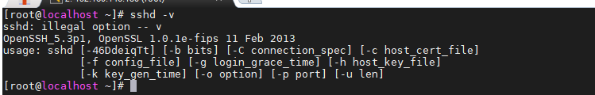
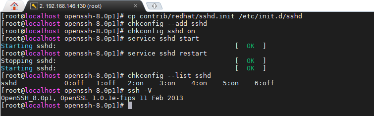

<!-- START doctoc generated TOC please keep comment here to allow auto update -->
<!-- DON'T EDIT THIS SECTION, INSTEAD RE-RUN doctoc TO UPDATE -->
**Table of Contents**  *generated with [DocToc](https://github.com/thlorenz/doctoc)*

- [openssh漏洞](#openssh%E6%BC%8F%E6%B4%9E)
- [探测到SSH服务器支持的算法](#%E6%8E%A2%E6%B5%8B%E5%88%B0ssh%E6%9C%8D%E5%8A%A1%E5%99%A8%E6%94%AF%E6%8C%81%E7%9A%84%E7%AE%97%E6%B3%95)
- [ICMP timestamp请求响应漏洞](#icmp-timestamp%E8%AF%B7%E6%B1%82%E5%93%8D%E5%BA%94%E6%BC%8F%E6%B4%9E)
- [禁Ping、Traceroute配置](#%E7%A6%81pingtraceroute%E9%85%8D%E7%BD%AE)
- [隐藏Linux版本信息](#%E9%9A%90%E8%97%8Flinux%E7%89%88%E6%9C%AC%E4%BF%A1%E6%81%AF)
- [锁定系统关键文件](#%E9%94%81%E5%AE%9A%E7%B3%BB%E7%BB%9F%E5%85%B3%E9%94%AE%E6%96%87%E4%BB%B6)
- [中间件版本信息泄露](#%E4%B8%AD%E9%97%B4%E4%BB%B6%E7%89%88%E6%9C%AC%E4%BF%A1%E6%81%AF%E6%B3%84%E9%9C%B2)
- [SSH版本信息可被获取漏洞解决方法](#ssh%E7%89%88%E6%9C%AC%E4%BF%A1%E6%81%AF%E5%8F%AF%E8%A2%AB%E8%8E%B7%E5%8F%96%E6%BC%8F%E6%B4%9E%E8%A7%A3%E5%86%B3%E6%96%B9%E6%B3%95)
- [SSH 支持弱加密算法漏洞](#ssh-%E6%94%AF%E6%8C%81%E5%BC%B1%E5%8A%A0%E5%AF%86%E7%AE%97%E6%B3%95%E6%BC%8F%E6%B4%9E)

<!-- END doctoc generated TOC please keep comment here to allow auto update -->

## openssh漏洞 ##

[原文地址](https://blog.csdn.net/hongdeng123/article/details/86267368)

> 1、查看系统ssh版本

> 2、下载最新openssh,上传至/root下

	https://cdn.openbsd.org/pub/OpenBSD/OpenSSH/portable/

> 3、安装telnet

避免ssh无法登录

	yum -y install telnet-server* zlib-devel

> 4、关闭防火墙，更改配置

	service iptables stop
	chkconfig iptables off
	sed -i 's#disable         = yes#disable         = no#g' /etc/xinetd.d/telnet

	mv /etc/securetty /etc/securetty.old    #允许root用户通过telnet登录
	service xinetd start                    #启动telnet服务
	chkconfig xinetd on                     #使telnet服务开机启动，避免升级过程中服务器意外重启后无法远程登录系统
	telnet [ip]                             #新开启一个远程终端以telnet登录验证是否成功启用

> 5、检查环境

官方给出的文档中提到的先决条件openssh安装依赖zlib1.1.4并且openssl>=1.0.1版本就可以了。

	openssl version
	rpm -q zlib
	rpm -q zlib-devel

> 6、安装依赖，卸载旧版本openssh

	yum install -y gcc openssl-devel pam-devel rpm-build pam-devel
	rpm -e `rpm -qa | grep openssh` --nodeps

> 7、编译新的openssh

版本号注意替换

**按行执行，谨记教训**

	tar zxvf openssh-8.0p1.tar.gz
	cd openssh-8.0p1
	./configure --prefix=/usr --sysconfdir=/etc/ssh --with-pam --with-zlib --with-md5-passwords --with-tcp-wrappers && make && make install
	sed -i 's/#PermitRootLogin prohibit-password/PermitRootLogin\ yes/g' /etc/ssh/sshd_config #或手动修改PermitRootLogin no 修改为 PermitRootLogin yes 允许root远程登陆
	sed -i 's/#PermitEmptyPasswords\(.*\)/PermitEmptyPasswords\ no/g' /etc/ssh/sshd_config  ##禁止空密码
	sed -i 's/^SELINUX\(.*\)/SELINUX=disabled/g' /etc/selinux/config  ##重点来了～～～禁止selinux 否则重启后会登录失败
	echo 'KexAlgorithms curve25519-sha256@libssh.org,ecdh-sha2-nistp256,ecdh-sha2-nistp384,ecdh-sha2-nistp521,diffie-hellman-group-exchange-sha256,diffie-hellman-group14-sha1,diffie-hellman-group-exchange-sha1,diffie-hellman-group1-sha1' >> /etc/ssh/sshd_config ## 写上新版ssh支持的算法
	cp contrib/redhat/sshd.init /etc/init.d/sshd
	chkconfig --add sshd
	chkconfig sshd on
	service sshd start
	service sshd restart
	chkconfig --list sshd
	ssh -V

> 8、关闭telnet开启防火墙

	mv /etc/securetty.old /etc/securetty   #允许root用户通过telnet登录
	service xinetd stop
	chkconfig xinetd off
	service iptables start
	chkconfig iptables on
	sed -i 's#disable         = no#disable         = yes#g' /etc/xinetd.d/telnet

## 探测到SSH服务器支持的算法 ##

描述：本插件用来获取SSH服务器支持的算法列表

处理：无法处理。ssh协议协商过程就是服务端要返回其支持的算法列表。

## ICMP timestamp请求响应漏洞 ##

描述：远程主机会回复ICMP_TIMESTAMP查询并返回它们系统的当前时间。 这可能允许攻击者攻击一些基于时间认证的协议。

处理：调整防火墙规则

	iptables -I INPUT -p ICMP --icmp-type timestamp-request -m comment --comment "deny ICMP timestamp" -j DROP
	iptables -I INPUT -p ICMP --icmp-type timestamp-reply -m comment --comment "deny ICMP timestamp" -j DROP

## 禁Ping、Traceroute配置

	echo "net.ipv4.icmp_echo_ignore_all=1"  >> /etc/sysctl.conf
	sysctl -p

## 隐藏Linux版本信息

	> /etc/issue
	> /etc/issue.net 

## 锁定系统关键文件

防止被篡改

	chattr +i /etc/passwd /etc/shadow /etc/group /etc/gshadow /etc/inittab

## 中间件版本信息泄露 ##

**nginx**

	#需要安装headers-more-nginx-module-master模块
	#（默认错误页也会爆露server信息，后续添加）
	nginx.conf -> http {... server_tokens off; more_set_headers "Server: Unknown"; ...}

**ftp**

	echo "ftpd_banner=this is vsftpd" >> /etc/vsftpd/vsftpd.conf
	service vsftp restart

**tomcat**

	由于一般作为nginx的上游服务器，隐藏方式后续添加
	

## SSH版本信息可被获取漏洞解决方法 ##

漏洞证明

解决方案

**并不生效，待修改**

	echo "Hello guest." >> /etc/ssh_banner_custom
	sed -i "s;#Banner none;#Banner /etc/ssh_banner_custom;g" /etc/ssh/sshd_config
	systemctl restart sshd
	

## SSH 支持弱加密算法漏洞 ##

> 升级openssh添加新的加密算法

https://blog.csdn.net/qq_40606798/article/details/86512610
