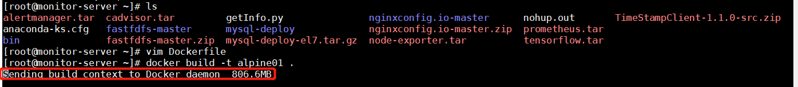

<!-- START doctoc generated TOC please keep comment here to allow auto update -->
<!-- DON'T EDIT THIS SECTION, INSTEAD RE-RUN doctoc TO UPDATE -->
**Table of Contents**  *generated with [DocToc](https://github.com/thlorenz/doctoc)*

- [定义转义符](#%E5%AE%9A%E4%B9%89%E8%BD%AC%E4%B9%89%E7%AC%A6)
- [环境变量](#%E7%8E%AF%E5%A2%83%E5%8F%98%E9%87%8F)
- [忽略文件](#%E5%BF%BD%E7%95%A5%E6%96%87%E4%BB%B6)
- [FROM](#from)
- [RUN](#run)
- [CMD](#cmd)
- [RUN vs CMD](#run-vs-cmd)
- [LABEL](#label)
- [MAINTAINER](#maintainer)
- [EXPOSE](#expose)
- [ENV](#env)
- [ADD](#add)
- [COPY](#copy)
- [COPY VS ADD](#copy-vs-add)
- [ENTRYPOINT](#entrypoint)
- [`shell form` vs `exec form`](#shell-form-vs-exec-form)
- [USER](#user)
- [WORKDIR](#workdir)
- [VOLUME](#volume)
- [SHELL](#shell)
- [HEALTHCHECK](#healthcheck)
- [STOPSIGNAL](#stopsignal)
- [ONBUILD](#onbuild)

<!-- END doctoc generated TOC please keep comment here to allow auto update -->

## 定义转义符 ##

适用于`windows平台`

	# escape=`

	FROM microsoft/nanoserver
	COPY testfile.txt c:\
	RUN dir c:\

## 环境变量 ##

	FROM busybox
	ENV foo /bar
	WORKDIR ${foo}   # WORKDIR /bar
	ADD . $foo       # ADD . /bar
	COPY \$foo /quux # COPY $foo /quux

`${variable_name}`支持bash一些标准：

1. ${variable:-word} variable为空则取word的值

1. ${variable:+word} variable非空则取word的值

**支持环境变量得到docker指令如下：**

1. ADD
2. COPY
3. ENV
4. EXPOSE
5. FROM
6. LABEL
7. STOPSIGNAL
8. USER
9. VOLUME
10. WORKDIR

## 忽略文件 ##

当执行构建`build`时docker-cli会先在指定的上下文目录中，寻找`.dockerignore`文件，docker-cli根据文件内容，排除context的路基目录或文件，随后再将信息发送给docker-daemon

**例子如下：**

	# comment
	*/temp*
	*/*/temp*
	temp?

**不忽略的话，会全部提交过去，如果当前上下文目录下文件较多/大，会影响镜像的build速度**

## FROM

**`FROM`可以在一个`Dockerfile`出现多次**

**`ARG`与`FROM`交互**

	ARG  CODE_VERSION=latest
	FROM base:${CODE_VERSION}
	CMD  /code/run-app
	
	FROM extras:${CODE_VERSION}
	CMD  /code/run-extras

**ARG生命周期**

在FROM之前声明的ARG位于构建阶段之外，因此不能在FROM之后的任何指令中使用它。若要使用第一个FROM之前声明的ARG的默认值，请使用构建阶段中没有值的ARG指令

	ARG VERSION=latest
	FROM busybox:$VERSION
	ARG VERSION
	RUN echo $VERSION > image_version

## RUN

**格式一：**

	RUN <command> (shell form, the command is run in a shell, which by default is /bin/sh -c on Linux or cmd /S /C on Windows)

**格式二：**

	RUN ["executable", "param1", "param2"]

**/bin/sh替换为/bin/bash**

	RUN ["/bin/bash", "-c", "echo hello"]

**docker-deamon执行与shell执行**

shell执行并返回结果
	
	Step 1/2 : FROM alpine
	 ---> 961769676411
	Step 2/2 : RUN [ "sh", "-c", "cat ~/.bash_profile" ]
	 ---> Running in f6a08aee1953
	cat: can't open '/root/.bash_profile': No such file or directory
	The command 'sh -c cat ~/.bash_profile' returned a non-zero code: 1

docker-deamon执行并返回结果

	Step 1/2 : FROM alpine
	 ---> 961769676411
	Step 2/2 : RUN [ "cat ~/.bash_profile" ]
	 ---> Running in 59d4ac8f5ff7
	OCI runtime create failed: container_linux.go:345: starting container process caused "exec: \"cat ~/.bash_profile\": stat cat ~/.bash_profile: no such file or directory": unknown

## CMD

**格式一：**

	CMD ["executable","param1","param2"] (exec form, this is the preferred form)

**格式二：**

	CMD ["param1","param2"] (as default parameters to ENTRYPOINT)

**格式三：**

	CMD command param1 param2 (shell form)

**CMD只能出现一次，最后的CMD指令会覆盖之前的指令**

**解析规则**

默认解析为shell指令

	FROM ubuntu
	CMD echo "This is a test." | wc -

	实际解析为
	
	FROM ubuntu
	CMD /bin/sh -c echo "This is a test." | wc -

以下格式必须使绝对径，并且命令用 `""`引用

	FROM ubuntu
	CMD ["/usr/bin/wc","--help"]

## RUN vs CMD

`RUN` 生效于镜像build时

	Step 1/2 : FROM alpine
	 ---> 961769676411
	Step 2/2 : RUN cat ~/.bash_profile
	 ---> Running in 446a0b3c52ce
	cat: can't open '/root/.bash_profile': No such file or directory
	The command '/bin/sh -c cat ~/.bash_profile' returned a non-zero code: 1

`CMD`生效于镜像启动为容器时

	Step 1/2 : FROM alpine
	 ---> 961769676411
	Step 2/2 : CMD cat ~/.bash_profile
	 ---> Running in 8b4e2c4c810f
	Removing intermediate container 8b4e2c4c810f
	 ---> 92382df2a644
	Successfully built 92382df2a644
	Successfully tagged alpine01:latest

	docker run -idt alpine01

返回容器ID `4542bb3760f4036c8044be744fbf5c948045bbfe4216aa7ae719e596a41dd859`

	docker logs -f 4542bb3760f4036c8044be744fbf5c948045bbfe4216aa7ae719e596a41dd859
	cat: can't open '/root/.bash_profile': No such file or directory

## LABEL

格式：

	LABEL <key>=<value> <key>=<value> <key>=<value> ...

样例：

	LABEL "com.example.vendor"="ACME Incorporated"
	LABEL com.example.label-with-value="foo"
	LABEL version="1.0"
	LABEL description="This text illustrates \
	that label-values can span multiple lines."

声明为一行：

	LABEL multi.label1="value1" multi.label2="value2" other="value3"

	LABEL multi.label1="value1" \
      multi.label2="value2" \
      other="value3"

## MAINTAINER

最新版已被移除，可以使用Label指令代替

	LABEL maintainer="SvenDowideit@home.org.au"

## EXPOSE

仅作说明用途，不会实际开放端口

## ENV

格式一：

	ENV <key> <value>

格式二：

	ENV <key>=<value> ...

## ADD

格式一：

	ADD [--chown=<user>:<group>] <src>... <dest>

格式二：

	ADD [--chown=<user>:<group>] ["<src>",... "<dest>"]

支持通配符：

	ADD hom* /mydir/        # adds all files starting with "hom"
	ADD hom?.txt /mydir/    # ? is replaced with any single character, e.g., "home.txt"

The `<dest>` is an absolute path, or a path relative to `WORKDIR`, into which the source will be copied inside the destination container

转义特殊字符：

	ADD arr[[]0].txt /mydir/    # copy a file named "arr[0].txt" to /mydir/

指定文件所属及权限：

	ADD --chown=55:mygroup files* /somedir/
	ADD --chown=bin files* /somedir/
	ADD --chown=1 files* /somedir/
	ADD --chown=10:11 files* /somedir/

If the container root filesystem does not contain either `/etc/passwd` or `/etc/group` files and either user or group names are used in the --chown flag, the build will fail on the ADD operation. Using numeric IDs requires no lookup and will not depend on container root filesystem content.

**ADD规则：**

- `<src>`必须位于build 上下文路径中，不可以使用相对路径（如ADD ../something /something）

- `<dest>`尽量以"/"结尾（ADD http://192.168.1.2:80/file1 /root/file2,会解析为将file1下载到/root下并命名为file2）

- 当`<src>`为目录时，则复制目录下的全部内容，包括文件系统元数据但不包含该目录

- `<src>`为可识别的压缩类型文件时（identity, gzip, bzip2 or xz，与文件名无关），会自动被解压

- If `<dest>` doesn’t exist, it is created along with all missing directories in its path.

## COPY

格式一：

	COPY [--chown=<user>:<group>] <src>... <dest>

格式二：

	COPY [--chown=<user>:<group>] ["<src>",... "<dest>"]

## COPY VS ADD

`COPY`不会自动解压缩

`COPY`支持`<src>`为URL类型

## ENTRYPOINT

格式一：

	ENTRYPOINT ["executable", "param1", "param2"]

格式二：

	ENTRYPOINT command param1 param2

## `shell form` vs `exec form`

两者的区别如下：

[`shell form` vs `exec form`](https://stackoverflow.com/questions/42805750/dockerfile-cmd-shell-versus-exec-form)

`shell form`本质为交由shell执行（默认/bin/sh）

`exec form`本质为交由docker-daemon执行

## USER

指定镜像启动后的容器内程序所属用户,默认root启动

	USER <user>[:<group>] or
	USER <UID>[:<GID>]

## WORKDIR

指定构建阶段的目录上下文

## VOLUME

映射docker宿主机与容器目录

## SHELL

多用于windows平台

The SHELL instruction allows the default shell used for the shell form of commands to be overridden. 

The default shell on Linux is ["/bin/sh", "-c"], and on Windows is ["cmd", "/S", "/C"]. The SHELL instruction must be written in JSON form in a Dockerfile.

## HEALTHCHECK

健康检测端点，判断容器内服务状态：

	HEALTHCHECK --interval=5m --timeout=3s \
  	CMD curl -f http://localhost/ || exit 1

可选配置：

	// 每30s检测一次
	--interval=DURATION (default: 30s)
	// 超时响应时间（超过30s未响应，代表不健康）
	--timeout=DURATION (default: 30s)
	// 容器启动多久后开启检测(取决于容器启动速度)
	--start-period=DURATION (default: 0s)
	// 重试次数
	--retries=N (default: 3)

退出码：

	0: success - the container is healthy and ready for use
	1: unhealthy - the container is not working correctly

## STOPSIGNAL

退出信号，默认SIGTERM（强制退出）

	STOPSIGNAL 9

可修改该值实现程序的平滑退出，值可以为信号名也可以为数字

## ONBUILD

相当于触发器，下次该镜像作为基础镜像时被触发

The `ONBUILD` instruction adds to the image a trigger instruction to be executed at a later time, 
when the image is used as the base for another build. 

	ONBUILD [INSTRUCTION]

ONBUILD不可触发的指令如下：

	FROM
	ONBUILD
	MAINTAINER